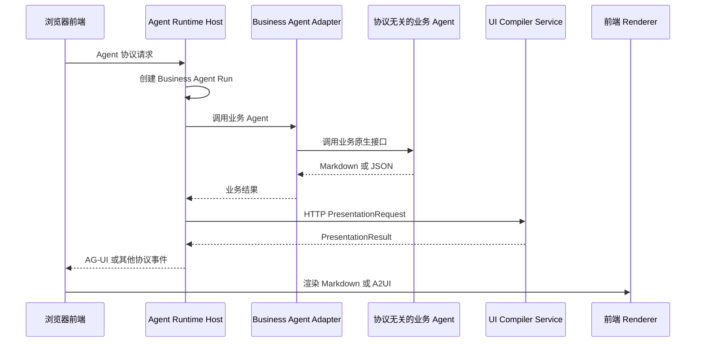

# Architecture

> **Status: Historical.**
> 本文保留 Compiler MVP 的历史架构基线。
> 其中描述的 Compiler、Presentation Pipeline、Runtime Host 和 contracts 均不属于当前仓库拓扑。

## 1. Product Architecture

Generative UI Compiler is an Agent presentation infrastructure layer.
The Business Agent content contract accepts Markdown or JSON structured data.
Presentation mode, presentation intent, and UI plans are not part of that contract.

The system first decides whether the content should use a simple Markdown representation or become a controlled generative UI.
Only content selected for generative UI enters UI Compiler Core.

```text
Business Agent / LLM Agent
returns Markdown / JSON

        |
        v

UI Compiler Service
        |
        v

Presentation Router
        |
        +---- markdown ----> Safe Markdown Representation
        |
        +---- generative-ui
                    |
                    v
        Schema-valid UI Plan Candidate
                    |
                    v
              UI Compiler Core
                    |
                    v
              A2UI / Fallback

        |
        v

Frontend Runtime
```

The service does not manage business Agent execution, Agent routing, workflow state, or business logic.

### 1.1 Agent Runtime Host 集成边界

UI Compiler Service 的规范网络入口是 HTTP `POST /api/ui-compiler/present`。
它接收 `PresentationRequest` 并返回 `PresentationResult`。
Compiler 不拥有 Business Agent Run，也不要求业务 Agent 实现 AG-UI。

Copilot Runtime 或其他 Agent Runtime Host 可以调用协议无关的业务 Agent，并在得到 Markdown 或 JSON 后调用 UI Compiler Service。
Agent Runtime Host 负责把 `PresentationResult` 映射为 AG-UI、WebSocket、SSE 或其他前端通信协议。
Agent Runtime Host 是当前 Compiler MVP 的外部系统。



AG-UI 和 A2UI 必须保持独立：

- AG-UI 描述前端与 Agent Runtime Host 之间的 Run、Step、消息和事件传输。
- A2UI 描述前端可以渲染的声明式 UI Surface。
- `PresentationResult` 是 UI Compiler Service 的规范应用层输出。
- A2UI Operations 是 `PresentationResult` 的 generative-ui 分支内容。
- AG-UI 只是 Agent Runtime Host 可以选择的一种传输封装。

## 2. Current MVP Modules

### UI Compiler Service

Responsibilities:

- 通过 HTTP 提供 `PresentationRequest` 到 `PresentationResult` 的主要网络接口。
- Receive Markdown or JSON structured data produced by an external Business Agent.
- Accept the original user message and presentation context when the caller can provide them.
- Sanitize Markdown before it enters routing, model analysis, Core, UI IR, A2UI, caching, or frontend output.
- Serialize structured data to a safe Markdown representation when generative UI is not selected.
- Load and validate the requested Component Catalog from an authorized source before routing.
- Derive the Router capability summary from that exact Catalog ID, version, and content hash.
- Invoke Presentation Router.
- Return ordinary content as a Markdown result without invoking UI Compiler Core.
- Pass a Schema-valid but still untrusted UI plan candidate, safe source data, and the validated Catalog to UI Compiler Core when generative UI is selected.
- Manage request lifecycle, cancellation, timeout, error mapping, and observability.

The service is the application composition root.
It selects and injects the concrete Model Adapter.
It is not a Business Agent and does not perform business reasoning, business tool calls, or Agent orchestration.
UI Compiler Service 不拥有 AG-UI Run 生命周期。

### Presentation Router

Presentation Router decides how Markdown or structured Agent content should be presented.
Its result is a discriminated union:

```ts
type PresentationDecision =
  | {
      mode: "markdown";
      reason: string;
    }
  | {
      mode: "generative-ui";
      reason: string;
      plan: UIPlan;
    };
```

The router may use deterministic shortcuts for unambiguous cases.
When semantic analysis is required, it uses a replaceable Model Adapter.
One model call should produce both the presentation decision and the UI plan candidate so the system does not pay for separate classification and planning calls.

The decision should consider the original user message when it is available.
Content without the original user message is accepted, but the system must treat the decision as lower confidence.

If routing or model analysis fails, the safe default is sanitized Markdown or a deterministic Markdown serialization of structured data.

### Model Adapter

The Model Adapter is outside UI Compiler Core.
It is responsible for:

- Calling a concrete model provider.
- Producing structured output that matches `PresentationDecision`.
- Enforcing model timeout and retry limits.
- Mapping provider errors to stable error codes.
- Preventing provider-specific response types from leaking into Core.

Model output is untrusted input.
It must not be executed and must pass contract, Catalog, Props, Action, and structural validation before it can become A2UI.

### UI Compiler Core

Responsibilities:

- Validate a generative UI compile request and treat its UI plan candidate as untrusted input.
- Validate the Component Catalog injected by the Service or another trusted Adapter.
- Reject Catalog ID or version mismatches between the request and injected Catalog.
- Recompute the injected Catalog content hash and compare it with the trusted Adapter option and Router summary identity.
- Resolve and validate component selections against the Catalog.
- Build framework-neutral UI IR.
- Compile UI IR to A2UI.
- Validate UI IR and A2UI.
- Produce deterministic fallback and diagnostics.

Core assumes that its caller has already selected generative UI.
Core does not decide between Markdown and generative UI.
Core does not call a model provider and does not depend on a model SDK.
Core must remain independent from:

- Frontend frameworks.
- Network services.
- Model providers.
- Specific Agent frameworks.
- Business domains.

### Frontend Runtime

The external Frontend Runtime consumes a presentation result.
It sends a Markdown result to its Markdown Renderer and a generative UI result to its A2UI Renderer and Component Registry.
Agent Runtime Host 可以通过 AG-UI 或其他协议传输该结果，但该映射不属于 Compiler MVP。

## 3. Contract Flow

```text
Agent Markdown / JSON
        |
        v
PresentationRequest
        |
        v
PresentationDecision
        |
        +---- markdown ------> PresentationResult.markdown
        |
        +---- generative-ui -> UICompileRequest
                                  |
                                  v
                            UI Compiler Core
                                  |
                                  v
                         PresentationResult.generative-ui
```

`PresentationRequest` contains Markdown or JSON structured data plus optional user and rendering context.
`PresentationDecision` is the validated output of Presentation Router.
A Model Adapter may produce an untrusted candidate decision, but that candidate is not a `PresentationDecision` until it passes Schema validation.
`UICompileRequest` describes an already selected and Schema-valid generative UI plan candidate.
It also contains `sourceKind`, safe `sourceData`, safe Fallback Markdown, and a Catalog reference.
Structured `sourceData` preserves the complete validated JSON.
Markdown `sourceData` is exactly `{ "markdown": sanitizedMarkdown }`.
The candidate remains non-authoritative until UI Compiler Core validates it against the active Catalog and lowers it to UI IR.
`PresentationResult` is the public service result and distinguishes a simple Markdown representation from generative UI.

## 4. Component Extension Model

Generative UI Compiler does not automatically create arbitrary business UI components.
Business-specific component declarations are provided through Component Catalog.
Their real frontend implementations are provided through an external Component Registry.

```text
Component Catalog

+-- Common Components
|   +-- Card
|   +-- Table
|   +-- Form
|
+-- Domain Components
    +-- GISMapPanel
    +-- DeviceControlPanel
    +-- TaskManagementPanel

Component type in A2UI
        |
        v
External Component Registry
        |
        v
Real frontend component
```

The model may suggest only component types declared by the active Catalog.
UI Compiler Core performs the authoritative selection and validation.

## 5. Dependency Direction

```text
ui-compiler-service
        |
        +---- model-adapter
        |
        +---- markdown-sanitizer
        |
        +---- structured-data-serializer
        |
        +---- ui-compiler-core
                    |
                    v
             contract packages
```

UI Compiler Core must not depend on UI Compiler Service or a concrete Model Adapter.
The MVP does not cross-request cache complete UI IR, compile results, A2UI Operations, source data, Fallback Markdown, or Surface IDs.
UI Compiler Service 不得依赖 Copilot Runtime，也不得以 AG-UI Endpoint 作为独立运行的前置条件。

## 6. Future Platform Extension: Interaction Gateway

This section is a non-normative roadmap and is not part of the current MVP.
Interaction Gateway may be considered when the product needs:

- Multiple Agent routing.
- Agent collaboration.
- Task or session state management.
- Human approval workflows.

```text
Frontend
    |
    v
Interaction Gateway
    |
    +---- Business Agents
    |
    +---- UI Compiler Service
```

Starting Gateway design requires an explicit scope-change issue and a new ADR.
That ADR must decide responsibilities, dependency direction, contracts, protocols, deployment boundaries, and acceptance criteria.
