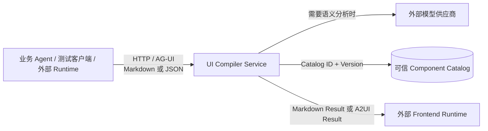
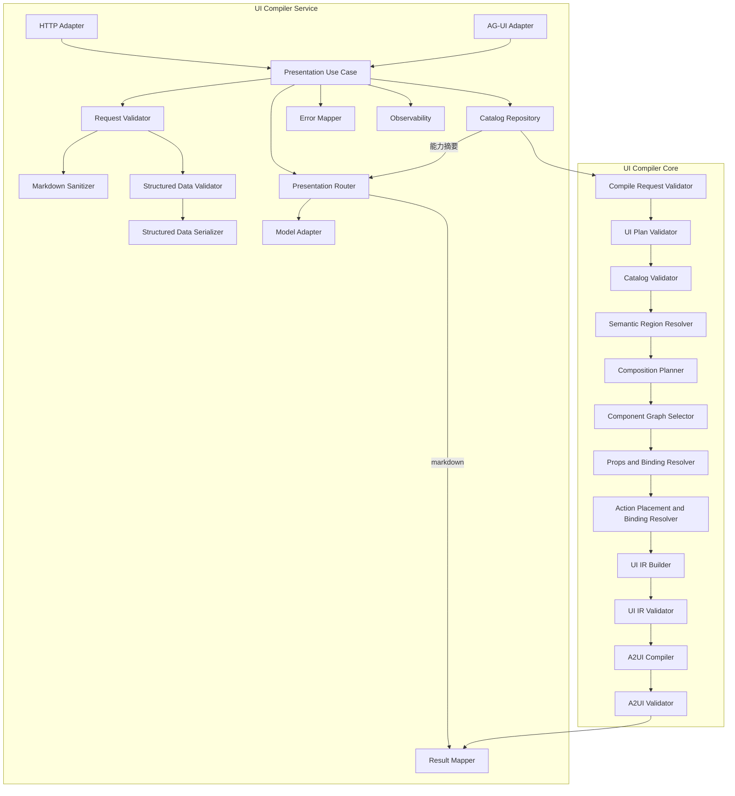
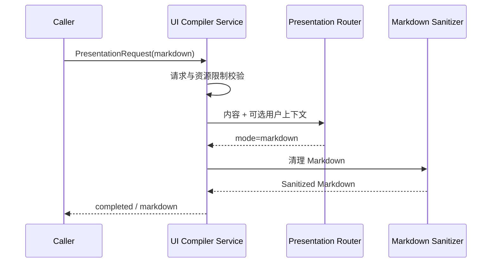
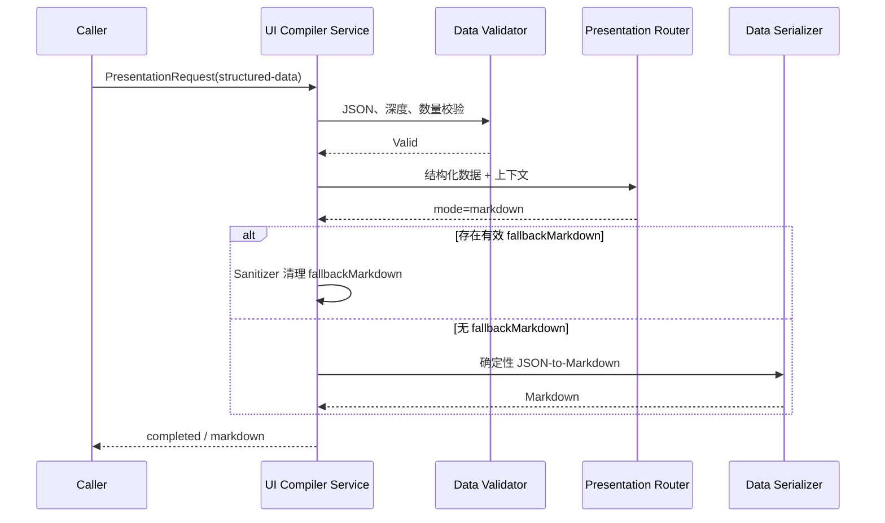
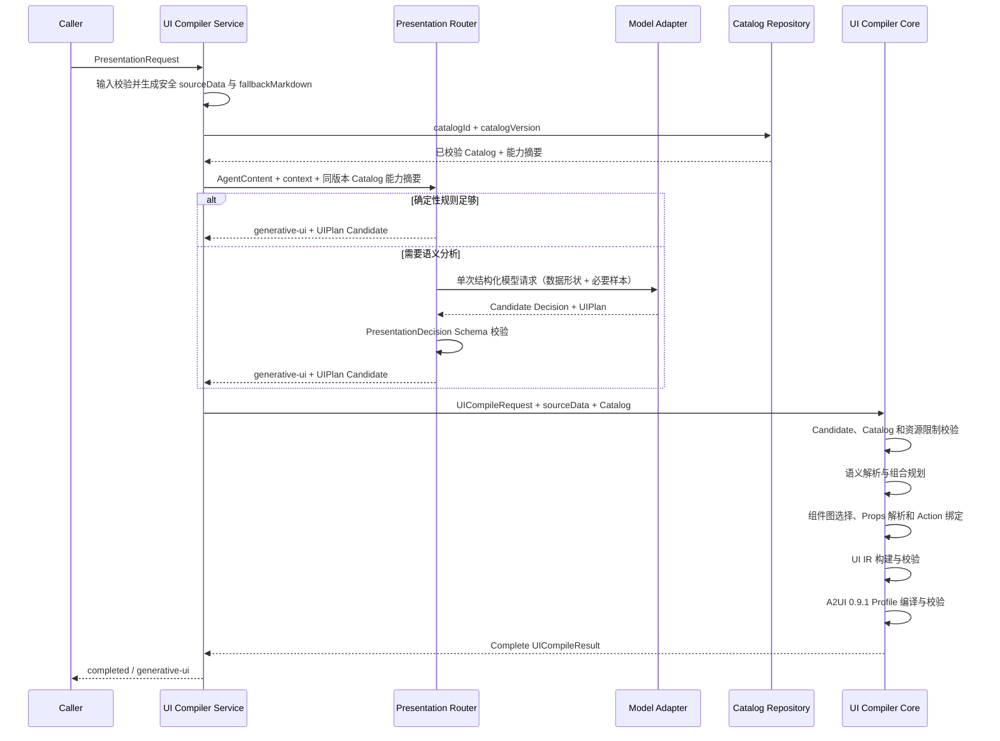
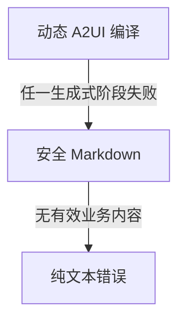
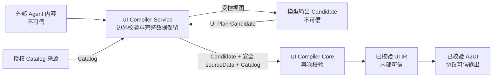
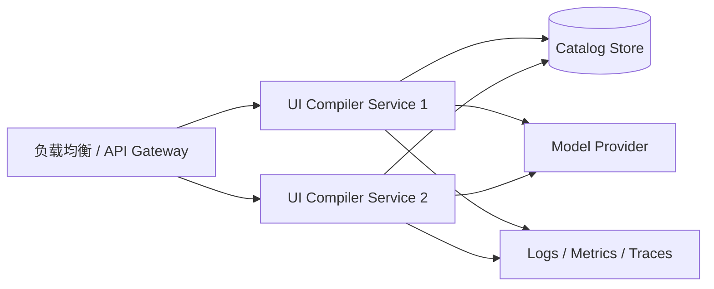
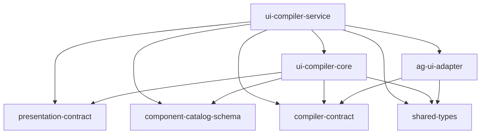

# Generative UI Compiler MVP 系统设计说明书

- **文档版本：** 1.2
- **设计阶段：** MVP 系统设计（评审修订版）
- **需求基线：** `docs/REQUIREMENTS.md` v1.4
- **适用范围：** Generative UI Compiler MVP
- **不适用范围：** Interaction Gateway、业务 Agent、Frontend Runtime、真实前端组件
- **规范状态：** 设计输入，尚未取代 `docs/REQUIREMENTS.md`

## 版本修订

v1.2 根据第二轮设计评审完成以下修订：

- 编译缓存改为只缓存不含请求数据和 Surface 标识的编译模板；
- Markdown 输入在进入模型、Core 或 A2UI 前统一安全清理；
- A2UI 发布版本与消息中的协议判别版本分离；
- `UICompileRequest`、Catalog 加载和 Catalog 引用一致性形成统一契约；
- Catalog 在展示路由前加载，Router 使用同一版本 Catalog 的能力摘要；
- 固定 UI 模板降级和 Surface 删除范围与需求及 ADR 对齐；
- 定义 UI IR Props、Binding 和 Action 到 A2UI 的精确映射；
- AG-UI Adapter 为缺失的 Thread ID 和 Run ID 生成稳定的请求级标识；
- 明确结构化数据序列化的数组和对象顺序规则；
- 修正公共错误阶段和错误代码混用。

v1.1 根据设计评审补齐：

- 预置组件组合和 Slot / CompositionPattern；
- Props 确定性生成；
- 完整 `sourceData` 与模型 `derivedData` 分离；
- Action 展示与组件事件绑定；
- Catalog 外部加载边界；
- A2UI 0.9.1 Profile；
- AG-UI 标准事件映射；
- 内部错误阶段到公共错误阶段映射；
- 删除与公共结果契约冲突的固定 UI 模板降级。

固定 UI 模板降级、A2UI Profile、编译输入数据所有权、AG-UI 映射和编译模板缓存分别由对应 ADR 固化。

---

## 1. 文档目的

本文将已经确认的产品需求转化为可实施、可评审、可测试的系统设计。

本文只描述目标系统，不讨论现有代码结构、历史实现或迁移方案。设计重点是：

1. 明确 UI Compiler Service、Presentation Router、Model Adapter、UI Compiler Core 的职责和依赖边界。
2. 定义从 Agent 内容到 Markdown 或 A2UI 的完整处理链路。
3. 明确 UI Plan Candidate、UI IR、Component Catalog、Action 和 A2UI 之间的关系。
4. 给出组件选择、Schema 校验、错误处理、降级、安全、缓存和可观测性设计。
5. 为后续详细设计、任务拆分、接口实现和测试提供依据。

---

## 2. 设计范围

### 2.1 本期系统

本期建设一个独立部署、无业务领域依赖的 **Generative UI Compiler**，包括：

- UI Compiler Service；
- Presentation Router；
- 可替换 Model Adapter；
- Markdown Sanitizer；
- Structured Data Validator；
- Structured Data Serializer；
- UI Compiler Core；
- Component Catalog Schema；
- UI Plan Candidate；
- UI IR；
- A2UI Compiler；
- HTTP Adapter；
- AG-UI Adapter；
- 错误、降级、超时、取消和可观测性能力。

### 2.2 外部系统

以下系统只作为调用方或消费方存在，不属于本期实现：

- 业务 Agent；
- Frontend Runtime；
- Component Registry；
- A2UI Renderer；
- Markdown Renderer；
- Copilot Runtime；
- Interaction Gateway；
- 业务权限、业务数据库、工作流和长期记忆系统。

### 2.3 明确禁止

系统禁止：

- 生成或执行任意 HTML、CSS、JavaScript、Vue、React 代码；
- 主动选择或调用业务 Agent；
- 承担多 Agent 路由、业务编排和工具调用；
- 保存权威业务状态、审批状态、工作流 Checkpoint 或长期记忆；
- 让模型输出直接成为 A2UI；
- 让 UI Compiler Core 调用模型或依赖网络协议；
- 要求业务 Agent 输出展示模式、组件类型或 UI Plan。

---

## 3. 设计目标与质量属性

### 3.1 核心设计目标

| 目标 | 设计要求 |
|---|---|
| 安全 | 模型和外部输入均视为不可信；所有结构、组件、Props、Actions 和 A2UI 必须校验 |
| 可降级 | 生成式 UI 失败不得造成有效业务内容丢失 |
| 确定性 | Core 在相同语义输入、Catalog 和配置下产生稳定组件规划；请求级 Surface 标识除外 |
| 框架无关 | Core 不依赖 Vue、React、浏览器、CopilotKit 或具体 Agent 框架 |
| 协议可适配 | UI IR 与 A2UI 解耦，未来可以增加其他输出协议 |
| 可扩展 | 通用组件和领域组件统一通过 Component Catalog 扩展 |
| 可部署 | Service 可独立启动、容器化并水平扩展 |
| 可测试 | 路由、编译、校验、降级和协议映射均可独立测试 |
| 可观测 | 每个请求可以定位路由、模型、编译、降级和错误阶段 |

### 3.2 设计原则

1. **先决定是否需要 UI，再执行 UI 编译。**
2. **模型负责建议，Core 负责裁决。**
3. **Candidate 表达语义意图，UI IR 表达权威组件图。**
4. **Catalog 是 Compiler 的组件能力边界。**
5. **Registry 是前端真实实现边界，Compiler 不持有组件实例。**
6. **所有失败优先返回可消费结果。**
7. **公共契约使用判别联合，禁止通过可选字段猜测状态。**
8. **安全校验不能通过配置关闭。**
9. **协议适配器不包含业务规则和编译规则。**
10. **默认无状态，缓存只优化性能，不改变业务语义。**

---

## 4. 系统上下文



### 4.1 系统责任边界

| 参与方 | 回答的问题 |
|---|---|
| 业务 Agent | 业务结果是什么 |
| Presentation Router | 应直接展示 Markdown，还是生成结构化 UI |
| Model Adapter | 如何调用模型获得受约束的候选展示决策 |
| UI Compiler Core | 如何把不可信 UI Plan Candidate 转换为可信 UI IR 和 A2UI |
| Component Catalog | 允许使用哪些组件、Props 和 Actions |
| Frontend Runtime | 如何把协议组件映射为真实组件并渲染 |

---

## 5. 总体逻辑架构



### 5.1 分层设计

| 层 | 主要职责 | 禁止职责 |
|---|---|---|
| 协议适配层 | HTTP、SSE、AG-UI 生命周期、状态码和事件映射 | 展示决策、组件选择、业务逻辑 |
| 应用编排层 | 请求生命周期、Catalog 获取、路由、模型注入、Core 调用、Markdown 降级整合 | 业务 Agent 编排、权威业务状态 |
| 展示决策层 | Markdown / generative-ui 判断和候选计划生成 | 直接生成 A2UI、决定最终组件图 |
| 确定性编译层 | Candidate 校验、组合规划、组件图选择、Props 解析、Action 绑定、UI IR 和 A2UI | 模型调用、网络访问、AG-UI Run 状态 |
| 契约层 | Schema、公共类型、错误代码、Catalog 和协议 Profile | 网络和运行时逻辑 |

### 5.2 组件生成模型

系统不生成新的 Vue、React 或 JavaScript 组件代码。
系统生成的是由预置组件声明组合而成的完整声明式 UI Surface。

```text
预置 Component Catalog
├── 原子组件：Text、Button、Alert
├── 容器组件：Card、List、布局容器
├── 结构组件：Table、Form、Steps、Timeline
└── 领域组件：由领域 Catalog 声明
            ↓
Semantic Region Resolution
            ↓
Composition Planning
            ↓
Component Graph Selection
            ↓
Props / Binding / Action Resolution
            ↓
完整 UI IR 组件图
            ↓
A2UI Surface
```

`allowedChildren` 和 Slot 规则用于校验组合是否合法；`CompositionPattern` 和 Composition Planner 用于决定应该如何组合。
二者不得混为同一能力。

## 6. 核心请求处理流程

### 6.1 Markdown 直接展示



约束：

- Markdown 路径不得调用 UI Compiler Core。
- 危险 HTML、内联脚本、危险 URL 和不支持结构必须被清理。
- 清理后为空时，返回结构化错误；如果仍有可消费文本，则返回降级结果。

### 6.2 结构化数据直接展示



Serializer 必须：

- 保留所有数组的原始顺序；
- 对象键使用 Unicode 码点升序的规范化排序，不承诺保留对象的声明顺序；
- 不执行输入；
- 不静默截断；
- 不自动摘要或改写业务事实；
- 在超过输出安全限制时明确失败，而不是返回不完整数据。

### 6.3 生成式 UI 成功流程



结构化输入的完整业务数据由 Service 直接传给 Core。
Markdown 输入在清理后以 `{ markdown: sanitizedMarkdown }` 形式进入 Core。
模型只提出语义和绑定建议，不拥有或重写完整业务数据。

### 6.4 降级流程

为与当前 `PresentationResult` 公共契约和 ADR-0009 保持一致，MVP 不采用“固定 UI 模板降级”。



降级原则：

1. 只要原始 Agent 内容有效，优先返回 `status = "degraded"`、`mode = "markdown"`。
2. 不得返回“部分成功”的非法或不完整 A2UI。
3. 不得为了降级再次调用模型。
4. 降级结果包含稳定错误代码、公共阶段、可重试标记和安全消息。
5. Core 使用请求中的安全 `fallbackMarkdown` 返回 degraded `UICompileResult` 和内部详细诊断，Service 将其映射为公共 `PresentationError`。
6. 只有输入本身不可用且无法形成安全文本时，才返回完整失败。

## 7. UI Compiler Service 设计

### 7.1 服务职责

UI Compiler Service 是应用组合根，负责：

- 接收并校验网络请求；
- 创建请求级上下文；
- 为结构化输入保留完整 `sourceData`，为 Markdown 输入生成清理后的 `sourceData`，并生成安全 `fallbackMarkdown`；
- 在展示路由前从受信任来源加载并校验 Catalog；
- 从该 Catalog 生成与完整 Catalog 同版本、同内容哈希的能力摘要；
- 为每次 generative-ui 编译生成请求级唯一 `surfaceId`；
- 调用 Presentation Router；
- 注入具体 Model Adapter；
- 在 generative-ui 分支将 Candidate、规范化数据和 Catalog 一并传给 Core；
- 映射 HTTP 响应或 AG-UI 事件；
- 处理取消、超时、日志、指标和错误；
- 对外提供存活、就绪和版本信息。

### 7.2 应用用例

建议将单次展示处理抽象为协议无关用例：

```ts
interface PresentUseCase {
  execute(
    request: PresentationRequest,
    context: RequestExecutionContext
  ): Promise<PresentationResult>;
}
```

`RequestExecutionContext` 只保存当前请求临时信息：

```ts
interface RequestExecutionContext {
  requestId: string;
  threadId: string;
  runId: string;
  catalogIdentity?: {
    catalogId: string;
    catalogVersion: string;
    catalogContentHash: string;
  };
  startedAt: number;
  signal: AbortSignal;
  transport: "http" | "ag-ui";
  traceContext?: TraceContext;
}
```

该上下文请求结束后销毁，不作为业务会话状态。
`catalogIdentity` 在 Catalog 校验完成后、调用 Router 前填入。
协议 Adapter 必须把可选的请求关联字段规范化为非空请求级 `threadId` 和 `runId`。
HTTP 不必把生成值写回 `PresentationResult`，AG-UI 必须在完整事件流中使用这些值。

### 7.3 HTTP 接口

#### 展示接口

```text
POST /api/ui-compiler/present
```

- 输入：`PresentationRequest`
- 输出：`PresentationResult`
- 功能：执行完整展示路由和可选 UI 编译。

#### 内部编译接口

```text
POST /api/ui-compiler/compile
```

- 可作为内部或 SDK 入口保留；
- 输入必须是已经选择 generative-ui 的 `UICompileRequest`；
- 网络入口只接受 `CatalogRef`，Catalog 必须由 Service 从受信任来源解析；
- 直接使用 Core 库的可信调用方通过 `CompileOptions` 注入完整 Catalog；
- Service 和 Core 都必须验证 `UICompileRequest.catalog` 与注入 Catalog 的 ID 和版本一致；
- Core 必须重新计算注入 Catalog 的内容哈希，并与 `CompileOptions.catalogContentHash` 一致；
- 网络部署必须通过路由隔离或访问控制将该入口限制为内部调用方；
- 禁止再次执行展示模式判断；
- 默认不作为业务 Agent 的主要接入入口。

#### 运维接口

```text
GET /health/live
GET /health/ready
GET /version
```

- `/health/live`：进程存活且事件循环能够响应。
- `/health/ready`：核心 Schema、基础 Catalog 和本地编译能力可用。
- 模型供应商不可用时，`ready` 可以返回 `status = "degraded"`，但不必判定整个服务不可用，因为 Markdown 路径仍可工作。
- 为兼容简单部署，可以保留 `/health` 并映射到 `/health/ready`。

### 7.4 HTTP 状态码策略

| 场景 | HTTP 状态 | PresentationResult |
|---|---:|---|
| 请求合法且得到 Markdown | 200 | completed |
| 请求合法且得到 A2UI | 200 | completed |
| 模型或编译失败但成功降级 | 200 | degraded |
| 请求 Schema 非法 | 400 | failed |
| 请求体过大 | 413 | failed |
| 客户端取消且尚未写出响应 | 499 或框架等价状态 | 连接终止 |
| 服务编排超时且无法降级 | 504 | failed |
| 未预期内部错误且无法降级 | 500 | failed |

取消不引入新的 `PresentationResult.status`。
若连接仍可写出，可以返回 `failed + REQUEST_CANCELLED`；若连接已经断开，只记录 Run 终止和诊断。

### 7.5 AG-UI 接口与事件映射

AG-UI Adapter 使用标准生命周期事件和 Step 事件。
项目结果通过 `CUSTOM` 事件承载，不新增伪标准事件类型。
AG-UI 标准生命周期事件要求 `threadId` 和 `runId`。
调用方未提供时，Adapter 必须在接收请求时生成请求级标识，并在整个事件流和请求上下文中复用。

#### 成功或降级 Run

```text
RUN_STARTED
STEP_STARTED(stepName="presentation-routing")
STEP_STARTED(stepName="model-analysis")       可选
STEP_FINISHED(stepName="model-analysis")      可选
STEP_FINISHED(stepName="presentation-routing")
STEP_STARTED(stepName="ui-compilation")       可选
STEP_FINISHED(stepName="ui-compilation")      可选
CUSTOM(name="generative-ui.presentation-result", value={mappingVersion:"1.0",result})
RUN_FINISHED
```

#### 无可消费结果的失败 Run

```text
RUN_STARTED
...
CUSTOM(name="generative-ui.presentation-error", value={mappingVersion:"1.0",errors})
RUN_ERROR
```

事件载荷约束：

```ts
interface PresentationResultCustomEvent {
  type: "CUSTOM";
  name: "generative-ui.presentation-result";
  value: {
    mappingVersion: "1.0";
    result: PresentationResult;
  };
}

interface PresentationErrorCustomEvent {
  type: "CUSTOM";
  name: "generative-ui.presentation-error";
  value: {
    mappingVersion: "1.0";
    errors: PresentationError[];
  };
}
```

设计约束：

- 每个 Run 必须以 `RUN_FINISHED` 或 `RUN_ERROR` 二选一结束；
- `RUN_STARTED`、`RUN_FINISHED` 和请求上下文必须使用相同的非空 `threadId` 与 `runId`；
- 已经返回可消费的 degraded Markdown 时使用 `RUN_FINISHED`；
- `STEP_STARTED` 与 `STEP_FINISHED` 必须成对且 `stepName` 相同；
- Core 不感知 Run、Thread 或事件流；
- MVP 通过 HTTP SSE 输出按顺序序列化的 AG-UI 事件；
- AG-UI Adapter 只依赖 `compiler-contract` 和 `shared-types`；
- `PresentationResult → CUSTOM` 的组装由 Service 完成，Adapter 只负责标准事件和通用 CustomEvent 序列化。

## 8. Presentation Router 设计

### 8.1 输入与输出

输入：

```ts
interface PresentationRoutingInput {
  content: AgentContent;
  fallbackMarkdown: string;
  context?: PresentationContext;
  catalogSummary: CatalogCapabilitySummary;
}

interface CatalogCapabilitySummary {
  catalogId: string;
  catalogVersion: string;
  catalogContentHash: string;
  supportedIntents: PresentationIntent[];
  componentCapabilities: CatalogComponentCapability[];
  actionTypes: string[];
}
```

`CatalogCapabilitySummary` 必须由已经通过校验的完整 Catalog 确定性生成。
Service 必须在请求上下文中保留该摘要的 ID、版本和内容哈希，并在调用 Core 前再次核对。
Markdown `AgentContent` 在传给 Router 前必须替换为已经安全清理的内容。

输出：

```ts
type PresentationDecision =
  | {
      mode: "markdown";
      reason: string;
    }
  | {
      mode: "generative-ui";
      reason: string;
      plan: UIPlan;
    };
```

### 8.2 路由步骤

```text
输入已通过资源校验
        ↓
构建安全 fallbackMarkdown
        ↓
确定性前置规则
        ↓
是否已经可以稳定决策？
   ├── 是：直接返回
   └── 否：单次 Model Adapter 调用
                 ↓
         Decision Schema 校验
                 ↓
         合法：返回决策
         非法：Markdown 降级
```

### 8.3 确定性规则

确定性规则仅处理高置信、可解释场景，禁止逐步演变为第二套不可维护的 UI 规划系统。

优先选择 Markdown：

- 纯叙述、解释、短回答；
- 没有结构化数据、状态、比较、步骤、时间线、表单或确认语义；
- Catalog 不支持候选展示能力；
- 内容规模不适合安全生成 UI；
- 缺少生成 UI 所需的最低数据；
- 模型功能关闭或不可用。

可以直接选择 generative-ui：

- 结构化数组明显适配 Table 或 List；
- 数据明确包含步骤、时间序列、状态集合；
- 请求上下文明确要求比较、确认或表单；
- Catalog 中存在唯一且完全匹配的领域组件；
- 规则能够生成完整、Schema 合法的 UI Plan Candidate。

### 8.4 Model Adapter 调用条件

满足以下任一情况时，可以调用模型：

- Markdown 中存在可视化价值，但确定性规则无法识别稳定结构；
- 用户意图与 Agent 内容需要联合判断；
- 存在多个合理展示方案；
- 需要从自然语言中提取语义区域和 Action 意图。

一次模型调用同时完成：

1. Markdown / generative-ui 决策；
2. generative-ui 分支的 UI Plan Candidate 生成。

禁止默认使用“分类模型调用 + UI 规划模型调用”的两阶段模型链路。

### 8.5 模型失败策略

| 失败类型 | 处理方式 |
|---|---|
| 超时 | 有效内容降级为 Markdown |
| 结构化输出非法 | 不修补为 A2UI，直接降级 |
| 暂时性供应商错误 | 在限制内重试 |
| 鉴权或配置错误 | 不重试，记录稳定错误代码并降级 |
| 内容安全拒绝 | 不绕过供应商策略，降级 |

---

## 9. Model Adapter 设计

### 9.1 统一接口

```ts
interface ModelAdapter {
  analyzePresentation(
    input: ModelPresentationInput,
    options: {
      signal: AbortSignal;
      timeoutMs: number;
    }
  ): Promise<ModelPresentationCandidate>;
}
```

Adapter 必须隔离：

- 模型 SDK；
- 供应商请求和响应类型；
- Structured Output 配置；
- 超时和重试；
- Token 使用量；
- 供应商错误码。

### 9.2 模型输入最小化与数据所有权

模型只接收完成展示判断所需的信息：

- 原始用户消息（存在时）；
- Agent 内容的受控视图；
- 可用展示意图枚举；
- Catalog 能力摘要，而不是完整前端实现；
- UI Plan Candidate JSON Schema；
- 安全约束和禁止项。

对超大结构化数据，Service 生成：

```ts
interface StructuredDataModelView {
  shape: DataShapeDescription;
  fieldStatistics?: FieldStatistics;
  samples: JsonValue[];
  sourceRoot: "sourceData";
}
```

模型看到的数据形状和样本只用于提出 Region、组件偏好和绑定路径。
模型输出不得承担完整业务数据的传递责任。

完整数据链路：

```text
原始结构化数据
      ↓
Service 保存完整 sourceData
      ├── 数据形状与必要样本 → Model Adapter
      └── 完整 sourceData → UI Compiler Core
```

对于 Markdown 输入：

- Service 必须先执行 Markdown 安全清理；
- `sourceData` 固定为 `{ markdown: sanitizedMarkdown }`；
- 原始未清理 Markdown 不得进入 Model Adapter、Core、UI IR、A2UI、缓存或日志；
- 模型或确定性规划器可以在 Candidate 中提供小规模 `derivedData`；
- `derivedData` 只用于展示提取结果，不得冒充原始业务事实；
- Core 在 UI IR 中保留绑定来源。

模型不得收到违反隐私和日志策略的数据副本。

### 9.3 重试规则

只对明确的瞬时错误进行有限重试，例如限流、临时网络失败和供应商 5xx。

禁止重试：

- Schema 校验失败；
- 鉴权失败；
- 不支持的模型能力；
- 内容被拒绝；
- 已取消请求；
- 已超过总请求截止时间。

---

## 10. UI Plan Candidate 与编译输入设计

### 10.1 设计定位

UI Plan Candidate 是模型或确定性规划器提出的**语义展示方案**，不是最终组件树，也不是完整业务数据容器。

它必须：

- 表达展示意图和语义区域；
- 通过安全路径引用规范化 `sourceData`；
- 可以包含 Markdown 提取形成的小规模 `derivedData`；
- 表达组件偏好但不具有权威性；
- 表达布局约束和 Action 意图；
- 与 Vue、React、DOM 和 A2UI 解耦；
- 保留从 Candidate 到 UI IR 的实质性 lowering。

### 10.2 UICompileRequest

```ts
interface UICompileRequest {
  requestId: string;
  threadId?: string;
  runId?: string;
  plan: UIPlan;
  sourceData: JsonValue;
  sourceKind: "markdown" | "structured-data";
  fallbackMarkdown: string;
  catalog: CatalogRef;
  context?: {
    locale?: string;
    theme?: string;
    viewport?: {
      width: number;
      height: number;
    };
  };
}
```

`sourceData` 的规范形状为：

- `sourceKind = "structured-data"` 时，`sourceData` 是通过资源校验的完整原始 JSON；
- `sourceKind = "markdown"` 时，`sourceData` 必须是 `{ "markdown": sanitizedMarkdown }`；
- Markdown Candidate 只能通过 `/markdown` 读取清理后的内容；
- `fallbackMarkdown` 必须已经通过 Markdown 安全清理。

数据所有权：

| 数据 | 所有者 | 信任级别 | 用途 |
|---|---|---|---|
| `sourceData` | Service 从 Agent 内容构造 | 结构化数据完整保留；Markdown 已安全清理 | 最终数据绑定 |
| `derivedData` | Model Adapter 或确定性规划器提出 | 不可信 Candidate | Markdown 语义提取或小规模派生展示数据 |
| UI IR Data Sources | Core 规范化生成 | Compiler 内部可信 | A2UI 数据模型生成 |

对结构化 Agent 输入，`sourceData` 必须保留完整原始 JSON。
Candidate 禁止将数据抽样结果复制为替代性的完整数据集。

### 10.3 Candidate 契约

```ts
type PresentationIntent =
  | "summary"
  | "status"
  | "comparison"
  | "timeline"
  | "confirmation"
  | "form"
  | "detail";

type RegionRole =
  | "header"
  | "summary"
  | "content"
  | "status"
  | "comparison"
  | "timeline"
  | "form"
  | "actions"
  | "detail";

interface UIPlan {
  schemaVersion: "1.0";
  intent: PresentationIntent;
  title?: string;
  description?: string;
  derivedData?: JsonValue;
  regions: UIRegionPlan[];
  actions?: ActionIntent[];
  layout?: SurfaceLayoutIntent;
}

interface UIRegionPlan {
  regionId: string;
  role: RegionRole;
  title?: string;
  description?: string;
  dataBinding?: CandidateDataBinding;
  literalContent?: JsonValue;
  componentPreferences?: string[];
  layout?: RegionLayoutIntent;
  children?: UIRegionPlan[];
}

interface CandidateDataBinding {
  source: "sourceData" | "derivedData";
  path: string;
}

interface SurfaceLayoutIntent {
  direction?: "vertical" | "horizontal" | "responsive";
  density?: "compact" | "comfortable";
  maxColumns?: number;
}

interface RegionLayoutIntent {
  width?: "full" | "auto" | "half" | "third";
  priority?: "primary" | "secondary" | "supporting";
  collapsible?: boolean;
}

interface ActionIntent {
  actionId: string;
  actionType: string;
  label: string;
  targetRegionId?: string;
  payload?: JsonValue;
  requiresApproval?: boolean;
  destructive?: boolean;
  presentation?: {
    placement?: "primary" | "secondary" | "inline";
    targetRole?: "actions" | "form" | "content";
    trigger?: "click" | "submit";
  };
}
```

### 10.4 Candidate 关键约束

1. `schemaVersion` 必须受支持。
2. `regionId` 和 `actionId` 在单个 Surface 内必须唯一。
3. `regions` 必须非空，并满足深度和数量限制。
4. 数据路径统一使用受限 JSON Pointer，只允许读取，不允许函数、过滤表达式和脚本求值。
5. `sourceData` 路径必须相对于完整输入数据；`derivedData` 路径必须相对于 Candidate 中的派生数据。
6. `componentPreferences` 只是偏好；Core 可以忽略或替换。
7. `componentPreferences` 中不存在于 Catalog 的类型不得直接进入 UI IR。
8. 每个 Region 必须满足以下至少一项：
   - 存在 `dataBinding`；
   - 存在 `literalContent`；
   - 存在非空 `children`。
9. `dataBinding` 与 `literalContent` 默认互斥；容器 Region 可以只包含 `children`。
10. Candidate Action 必须经过 Catalog ActionDefinition 校验。
11. Action 的 `presentation` 只是展示提示；最终组件、事件和绑定由 Core 决定。
12. Candidate 不得指定最终 `componentId`、最终组件层级或 A2UI 操作。
13. `derivedData` 必须满足独立的深度和数量限制，且不得用于替代未完整传入模型的结构化 `sourceData`。

### 10.5 Markdown 与结构化输入规则

#### 结构化数据

```text
Agent JSON
  ↓
完整 sourceData
  ↓
Candidate 只引用 sourceData 路径
```

模型可以根据样本建议 `/devices` 使用 Table，但最终 Table 行数据来自完整 `/devices`，不是模型样本。

#### Markdown

```text
Agent Markdown
  ├── Sanitizer
  ├── sourceData = { markdown: 清理后的 Markdown }
  └── derivedData = 可选的结构化提取结果
```

Core 不验证提取出的业务事实是否正确，但必须记录其来源为 `derivedData`，不能与原始结构化业务数据混淆。

## 11. Component Catalog 与组合模型设计

### 11.1 Catalog 定位

Component Catalog 是 Compiler 可使用组件、组合模式和 Action 的权威能力声明。

它描述：

- 组件类型、类别和语义；
- Props Schema；
- Props 解析策略；
- 可接受的数据形状；
- Slot 和子组件约束；
- 允许的 Action；
- 支持的展示意图；
- 布局能力；
- 组合模式；
- Catalog 版本。

它不包含：

- Vue、React 或 Flutter 组件实现；
- 组件实例、CSS、浏览器 API；
- 任意可执行函数或远程脚本；
- 业务状态。

### 11.2 Catalog 契约

```ts
interface ComponentCatalog {
  catalogId: string;
  catalogVersion: string;
  schemaVersion: "1.0";
  components: ComponentDefinition[];
  actions: ActionDefinition[];
  compositionPatterns: CompositionPatternDefinition[];
}

interface ComponentDefinition {
  componentType: string;
  displayName: string;
  description: string;
  kind: "primitive" | "container" | "composite" | "domain";
  semanticRoles: RegionRole[];
  supportedIntents: PresentationIntent[];
  propsSchema: JsonSchema;
  propResolution: PropResolutionDefinition;
  dataCapabilities?: DataCapability[];
  slots?: Record<string, SlotDefinition>;
  allowedActions?: string[];
  layoutCapabilities?: string[];
  priority?: number;
  domainTags?: string[];
}

interface SlotDefinition {
  required?: boolean;
  minItems?: number;
  maxItems?: number;
  allowedComponentTypes?: string[];
  allowedKinds?: ComponentDefinition["kind"][];
  allowedRoles?: RegionRole[];
}

type PropResolutionDefinition =
  | { strategy: "literal-or-binding" }
  | { strategy: "table"; columns: "infer-from-records" | "catalog-defined" }
  | { strategy: "list"; itemMode: "scalar" | "record" }
  | { strategy: "alert"; severityPath?: string }
  | { strategy: "timeline"; timePath?: string; titlePath?: string }
  | { strategy: "steps"; titlePath?: string; statusPath?: string }
  | { strategy: "form"; fieldSource: "schema" | "records" }
  | { strategy: "direct-domain-binding" };

interface CompositionPatternDefinition {
  patternId: string;
  intent: PresentationIntent;
  rootComponentType: string;
  regions: CompositionRegionRule[];
  priority: number;
}

interface CompositionRegionRule {
  targetSlot: string;
  sourceRoles: RegionRole[];
  minItems?: number;
  maxItems?: number;
  wrapperComponentType?: string;
}

interface ActionDefinition {
  actionType: string;
  description: string;
  payloadSchema: JsonSchema;
  supportedTriggers: Array<"click" | "submit">;
  defaultRequiresApproval?: boolean;
  destructive?: boolean;
}
```

Catalog 中的 `propResolution.strategy` 是受控枚举，不是函数名、类名或动态插件入口。

### 11.3 基础组件分类

MVP 基础 Catalog 至少声明：

| 类别 | 组件 |
|---|---|
| 原子组件 | Text、Markdown、Button、Alert |
| 容器组件 | Card、List、Column、Row |
| 结构组件 | Table、Form、Steps、Timeline |
| 领域组件 | 至少一个测试 Fixture 中声明的 Domain Component |

布局容器属于声明式组件，用于组成完整 Surface，不是前端 CSS 代码。

### 11.4 组合模式

MVP 至少提供以下确定性组合模式：

```text
summary:
Card
├── header: Text
└── body: Text | List

status:
Card
├── header: Text
├── body: Alert? + Table | List
└── actions: Button*

comparison:
Card
├── header: Text?
└── body: Table

timeline:
Card
├── header: Text?
└── body: Timeline | Steps

confirmation:
Card
├── body: Text | List
└── actions: Button+

form:
Card
├── body: Form
└── actions: Button?

detail:
Card
├── header: Text?
└── body: List | Table | Domain Component
```

这些模式是默认候选，不是硬编码的唯一布局。
领域 Catalog 可以增加新的 `CompositionPatternDefinition`，但仍必须通过 Slot、Props 和 Action 校验。

### 11.5 Catalog 获取与 Core 边界

Service 侧负责外部获取：

```ts
interface CatalogRepository {
  getCatalog(
    ref: CatalogRef,
    options: { signal: AbortSignal }
  ): Promise<ComponentCatalog>;
}
```

Core 侧只负责校验已经传入的 Catalog：

```ts
interface CompileOptions {
  catalog: ComponentCatalog;
  catalogContentHash: string;
  surfaceId: string;
  limits: CompileLimits;
  selectionPolicy: SelectionPolicy;
  signal: AbortSignal;
}
```

安全规则：

- 请求只传 `catalogId` 和 `catalogVersion`，不得传任意远程 URL；
- Catalog 只能由 Service 从受信任本地包、镜像资源或授权配置存储获取；
- Core 不执行网络访问；
- Catalog 进入 Core 后仍必须通过 Schema、引用完整性和版本校验；
- Core 必须验证请求中的 `catalogId + catalogVersion` 与传入 Catalog 完全一致；
- Core 必须重新计算传入 Catalog 的规范化内容哈希，并与 `catalogContentHash` 一致；
- Service 传给 Router 的能力摘要必须由同一个已校验 Catalog 生成，并携带相同的内容哈希；
- 相同 `catalogId + catalogVersion` 必须不可变；
- 缓存键使用 `catalogId + catalogVersion + contentHash`；
- 未找到、版本不兼容或校验失败时由 Service 降级为 Markdown。

### 11.6 Catalog 与 Registry

```text
Component Catalog
声明“允许生成什么以及如何组合”
        ↓
A2UI 中的 componentType
        ↓
Frontend Component Registry
决定“使用哪个真实组件实现”
```

Compiler 只保证输出符合 Catalog。
调用方必须确保 Catalog 版本与前端 Registry 能力一致。

## 12. UI Compiler Core 设计

### 12.1 Core 接口

```ts
interface UICompilerCore {
  compile(
    request: UICompileRequest,
    options: {
      catalog: ComponentCatalog;
      catalogContentHash: string;
      surfaceId: string;
      limits: CompileLimits;
      selectionPolicy: SelectionPolicy;
      signal: AbortSignal;
    }
  ): Promise<UICompileResult>;
}
```

Core 是纯编译能力：

- 不启动服务；
- 不调用模型；
- 不访问网络或 Catalog Store；
- 不维护会话；
- 不感知 HTTP 或 AG-UI；
- 不依赖浏览器；
- 输入输出均可序列化和测试。

`surfaceId` 由 Service 或直接调用 Core 的可信 Adapter 为每次编译生成。
Service 不接受外部 Candidate 指定 `surfaceId`，并使用 UUID 或等价的高熵标识保证 Renderer 生命周期内的实际唯一性。
请求级 `surfaceId` 不参与确定性组件规划，也不得进入跨请求缓存。

### 12.2 编译管线

```text
UICompileRequest + ComponentCatalog
    ↓
1. Input Validation
    ↓
2. UI Plan Candidate Validation
    ↓
3. Catalog Validation
    ↓
4. Semantic Region Resolution
    ↓
5. Composition Pattern Matching
    ↓
6. Component Graph Planning
    ↓
7. Component Candidate Filtering and Selection
    ↓
8. Props and Data Binding Resolution
    ↓
9. Action Placement and Binding
    ↓
10. UI IR Construction
    ↓
11. UI IR Validation
    ↓
12. A2UI 0.9.1 Profile Compilation
    ↓
13. A2UI Validation
    ↓
UICompileResult
```

每个阶段：

- 输入和输出类型明确；
- 使用内部 `CompileStage`；
- 可以返回结构化诊断；
- 在阶段边界检查取消和超时；
- 不允许跳过 Schema 校验。

### 12.3 语义区域解析

Core 将 Candidate Region 规范化为 `ResolvedRegion`：

```ts
interface ResolvedRegion {
  regionId: string;
  role: RegionRole;
  content:
    | { kind: "binding"; source: "sourceData" | "derivedData"; path: string; valueShape: DataShape }
    | { kind: "literal"; value: JsonValue }
    | { kind: "container" };
  children: ResolvedRegion[];
  componentPreferences: string[];
  layout: NormalizedRegionLayout;
  actions: ActionIntent[];
}
```

处理内容：

- 检查 Region ID；
- 解析并验证 JSON Pointer；
- 验证绑定来源和数据路径；
- 推断数据形状；
- 合并 Surface 和 Region 布局约束；
- 验证 Action `targetRegionId`；
- 允许纯容器 Region；
- 不调用模型补全语义。

### 12.4 Composition Planner

Composition Planner 负责从语义 Region 生成**组件图计划**，不是只为每个 Region挑选一个组件。

输入：

- `PresentationIntent`；
- Resolved Region 树；
- Catalog `compositionPatterns`；
- Slot 约束；
- Viewport；
- Action 展示提示。

输出：

```ts
interface ComponentGraphPlan {
  root: PlannedComponentNode;
  diagnostics: CompositionDiagnostic[];
}

interface PlannedComponentNode {
  nodeId: string;
  role?: RegionRole;
  requestedComponentTypes: string[];
  sourceRegionIds: string[];
  targetSlot?: string;
  children: PlannedComponentNode[];
}
```

算法：

1. 按 Intent 过滤 `CompositionPattern`。
2. 验证 Pattern 的 root 和 Slot 在 Catalog 中存在。
3. 将 Region 按 Role 分配到 Pattern Slot。
4. 对未匹配 Region 使用通用容器规则：
   - 单 Region 可以直接作为根节点候选；
   - 多 Region 默认使用 `Column`；
   - 横向布局且 Viewport 足够时可以使用 `Row`。
5. 根据 Slot 的最小、最大数量和允许类型执行硬过滤。
6. 对合法 Pattern 使用 `priority`、覆盖率、额外包装数量和 Viewport 适配度稳定评分。
7. 无合法组合计划时返回 `NO_COMPATIBLE_COMPOSITION`。

### 12.5 Component Graph Selector

对 `PlannedComponentNode` 分别执行“硬过滤 + 稳定评分”。

#### 硬过滤

候选组件必须同时满足：

1. 存在于当前 Catalog；
2. 符合计划节点类别和 Slot；
3. 支持 Region Role；
4. 支持 Surface Intent；
5. 数据形状满足 `dataCapabilities`；
6. 所需 Action 在 `allowedActions` 中；
7. Props 存在可用的受控解析策略；
8. Viewport 和布局能力不冲突。

#### 稳定评分

```text
总分 =
  组件显式偏好匹配
+ Region Role 匹配
+ Presentation Intent 匹配
+ 数据形状适配度
+ Action 适配度
+ Viewport 适配度
+ Catalog priority
- 额外包装复杂度
```

设计要求：

- 权重由版本化配置提供；
- 相同输入下结果稳定；
- 分数相同时按 Catalog 声明顺序和组件类型字典序稳定决胜；
- 输出选择诊断，不记录敏感业务原文。

### 12.6 Props and Data Binding Resolver

Props Schema 只负责验证，Props Resolver 负责确定性构造。

统一接口：

```ts
interface PropResolver {
  strategy: PropResolutionDefinition["strategy"];
  resolve(input: PropResolutionInput): PropResolutionResult;
}

interface PropResolutionResult {
  props: Record<string, JsonValue>;
  bindings: PropBindingIR[];
}
```

MVP 内置受控 Resolver：

| 策略 | 主要输出 |
|---|---|
| literal-or-binding | Text、Markdown、Button 等简单属性 |
| table | `columns`、行数据绑定、空状态 |
| list | item 映射和集合绑定 |
| alert | message、severity |
| timeline | time、title、description 项映射 |
| steps | title、status 项映射 |
| form | fields、默认值绑定、submit Action |
| direct-domain-binding | 将经过 Schema 允许的数据绑定传给领域组件 |

Table 规则：

1. 输入必须是记录数组，或由 Catalog 显式允许单记录。
2. 字段顺序优先使用 Catalog 配置，其次使用首个记录的规范化键顺序。
3. 列标题使用 Catalog 字段元数据；缺失时使用字段名，不调用模型翻译。
4. 行数据绑定到完整 `sourceData` 路径。
5. 不复制或截断数组。

对象规范化排序只用于生成稳定列定义；数组顺序始终保留原始顺序。

### 12.7 Action Placement and Binding Resolver

Action Resolver 根据以下信息确定最终交互组件和事件：

- `ActionIntent.presentation`；
- Region Role；
- Composition Slot；
- Catalog `allowedActions`；
- ActionDefinition `supportedTriggers`；
- 组件类型和 Props Schema。

规则：

1. `placement = primary` 优先进入 `actions` Slot 的主 Button。
2. `placement = secondary` 使用次级 Button。
3. `targetRole = form` 且支持 `submit` 时绑定 Form submit。
4. 未给出提示时，确认类 Action 默认进入 `actions` Slot。
5. 一个 Action 可以绑定多个组件，但至少有一个有效绑定。
6. 找不到合法承载组件时返回 `ACTION_BINDING_UNRESOLVED`。
7. Candidate 不得指定最终 `componentId`。

### 12.8 基础展示映射

| 展示意图 | 默认组合 |
|---|---|
| summary | Card + Text/List |
| status | Card + Alert + Table/List |
| comparison | Card + Table |
| timeline | Card + Timeline/Steps |
| confirmation | Card + Text/List + Button |
| form | Card + Form + 可选 Button |
| detail | Card + List/Table/Domain Component |

领域组件与基础组件使用同一组合、选择、Props 校验和 Action 绑定流程。

## 13. UI IR 设计

### 13.1 UI IR 定位

UI IR 是 Core 经过权威校验和规范化后生成的可信中间表示。
“可信”只表示结构、引用、组件、Props、Binding 和 Action 已通过 Compiler 校验。
`sourceData` 中的业务事实仍来自外部系统，不因进入 UI IR 而变成可信业务事实或可执行内容。

| UI Plan Candidate | UI IR |
|---|---|
| 语义建议 | 权威组件图 |
| Region 和组件偏好 | 已确定组件、Slot 和层级 |
| 候选数据路径 | 已验证数据源和只读绑定 |
| Action 意图 | 已绑定组件和事件的 Action |
| 模糊布局 | 规范化布局 |
| 不可信 | Compiler 内部可信 |

### 13.2 UI IR 契约

```ts
interface UISurfaceIR {
  irVersion: "1.0";
  surfaceId: string;
  catalog: CatalogRef;
  rootComponentId: "root";
  components: ComponentIR[];
  dataSources: {
    sourceData: JsonValue;
    derivedData?: JsonValue;
  };
  actions: ActionIR[];
  actionBindings: ComponentActionBindingIR[];
  metadata: {
    intent: PresentationIntent;
    locale?: string;
    theme?: string;
  };
}

interface ComponentIR {
  componentId: string;
  componentType: string;
  props: Record<string, JsonValue>;
  bindings?: PropBindingIR[];
  slots?: Record<string, string[]>;
  children: string[];
  layout?: LayoutIR;
  sourceRegionIds: string[];
}

interface PropBindingIR {
  prop: string;
  source: "sourceData" | "derivedData";
  path: string;
}

interface ActionIR {
  actionId: string;
  actionType: string;
  label: string;
  payload?: JsonValue;
  requiresApproval: boolean;
  destructive: boolean;
}

interface ComponentActionBindingIR {
  componentId: string;
  actionId: string;
  event: "click" | "submit";
}
```

### 13.3 UI IR 不变量

1. `surfaceId` 在目标 Renderer 生命周期内唯一，并且不从 Candidate 或跨请求缓存取得。
2. 根组件 ID 固定规范化为 `root`。
3. `componentId` 在 Surface 内唯一。
4. 所有 `children` 和 Slot 引用必须存在。
5. 每个非根组件最多只有一个父组件。
6. 组件图必须无环且所有组件可从根到达。
7. 每个组件类型必须存在于 Catalog。
8. Props 必须通过对应组件 Schema。
9. 数据绑定路径必须存在或被组件定义允许为空。
10. 绑定到 `sourceData` 的数据必须保持完整；Resolver 不得静默裁剪集合。
11. Action 类型必须存在于 Catalog。
12. Action 必须绑定到至少一个组件。
13. 组件必须允许被绑定的 Action 和事件。
14. Action payload 必须通过对应 Schema。
15. 破坏性和审批标记不得弱于 Catalog 默认安全级别。
16. UI IR 不包含函数、DOM、Store、组件实例和协议事件。
17. A2UI 0.9.1 MVP Profile 中，每个组件最多绑定一个 Action。

## 14. A2UI 0.9.1 Profile 编译设计

### 14.1 协议基线

MVP 锁定 **A2UI 0.9.1 发布版的 v0.9 协议 Profile**。
上游协议升级不会自动改变 Compiler 输出；升级必须通过 ADR、契约测试和版本变更。

版本含义必须严格区分：

- Profile 和验证器基线版本是 `0.9.1`；
- 每条 A2UI 消息的协议判别字段是 `version: "v0.9"`；
- 禁止把发布补丁版本 `"v0.9.1"` 写入消息的 `version` 字段。

本项目支持的消息子集：

```ts
type A2UIOperation =
  | CreateSurfaceOperation
  | UpdateComponentsOperation
  | UpdateDataModelOperation;
```

所有消息包含：

```ts
interface A2UIBaseMessage {
  version: "v0.9";
}
```

### 14.2 精确操作契约

```ts
interface CreateSurfaceOperation extends A2UIBaseMessage {
  createSurface: {
    surfaceId: string;
    catalogId: string;
    theme?: JsonValue;
    sendDataModel?: false;
  };
}

interface UpdateComponentsOperation extends A2UIBaseMessage {
  updateComponents: {
    surfaceId: string;
    components: A2UIComponent[];
  };
}

interface A2UIComponent {
  id: string;
  component: string;
  [property: string]: JsonValue;
}

interface UpdateDataModelOperation extends A2UIBaseMessage {
  updateDataModel: {
    surfaceId: string;
    path: "/";
    value: JsonValue;
  };
}

interface A2UIEventAction {
  event: {
    name: string;
    context: {
      actionId: string;
      payload?: JsonValue;
      requiresApproval: boolean;
      destructive: boolean;
    };
  };
}
```

约束：

- 根组件 ID 必须是 `root`；
- 组件使用扁平 ID 引用结构；
- 数据绑定使用标准 JSON Pointer `{ "path": "/..." }`；
- `catalogId` 使用由部署约定映射出的稳定 Catalog 标识，不接受 Candidate 提供的 URL；
- MVP 只生成初次完整 Surface，不支持替换或删除已存在的 Surface；
- `deleteSurface` 和替换流程属于未来增量 Surface 生命周期扩展。

### 14.3 UI IR 映射

```text
UISurfaceIR.catalog
  → createSurface.catalogId

UISurfaceIR.components
  → updateComponents.components

UISurfaceIR.dataSources
  → updateDataModel.value = {
      sourceData,
      derivedData?
    }

PropBindingIR(sourceData, /devices)
  → { path: "/sourceData/devices" }

PropBindingIR(derivedData, /summary)
  → { path: "/derivedData/summary" }

ComponentActionBindingIR(button-1, approve-task, click)
  → {
      action: {
        event: {
          name: "task.approve",
          context: {
            actionId: "approve-task",
            payload,
            requiresApproval,
            destructive
          }
        }
      }
    }
```

Props、Binding 和 Action 使用以下精确映射规则：

1. `ComponentIR.props` 中除保留字段外的属性按原名称平铺到 A2UI Component。
2. `id`、`component` 和 `action` 是 A2UI Compiler 保留字段，Catalog Props Schema 不得自行定义。
3. `PropBindingIR.prop` 必须引用 Props Schema 中允许绑定的属性。
4. Binding 将对应属性值替换为 `{ "path": "/sourceData/..." }` 或 `{ "path": "/derivedData/..." }`。
5. `ComponentActionBindingIR` 按上面的 `A2UIEventAction` 结构写入组件的 `action` 属性。
6. A2UI 0.9.1 MVP Profile 的单个组件最多写入一个 `action` 属性，因此每个组件最多绑定一个 Action。
7. Action `event.name` 使用经过 Catalog 校验的 `actionType`，`event.context` 使用经过 Schema 校验的安全字段。
8. 不支持映射的 Props、Binding 或 Action 必须产生结构化编译错误，禁止猜测属性名。

Catalog 的 `propsSchema` 定义协议无关的规范化 Props。
A2UI 0.9.1 Profile Schema 定义最终扁平组件、Binding 和 Action Envelope。
二者都必须通过校验。

### 14.4 初次完整输出顺序

```text
1. createSurface
2. updateComponents
3. updateDataModel
```

同一结果内：

- `createSurface` 必须最先出现；
- `updateComponents` 中必须包含 `id = "root"`；
- `updateDataModel` 写入完整数据模型；
- 所有组件引用必须在同一批 `updateComponents` 中可解析；
- 任何一步校验失败都不得返回部分数组。

### 14.5 输出校验

必须校验：

- `version = "v0.9"`；
- 消息判别联合；
- Surface ID 一致；
- Catalog ID 一致；
- 根组件存在；
- 组件引用无环且完整；
- JSON Pointer 合法；
- Action 结构符合目标 Catalog；
- 操作顺序合法；
- 禁止字段和非法扩展。

A2UI 校验失败且存在有效 `fallbackMarkdown` 时，Core 返回 degraded `UICompileResult`。
没有有效 Fallback 时，Core 返回完整失败。
Service 将 degraded 结果映射为安全 Markdown `PresentationResult`。

## 15. Action 设计

### 15.1 MVP 定位

Action 只描述“用户可以做什么”，不实现完整业务执行闭环。

```json
{
  "actionId": "approve-task",
  "actionType": "task.approve",
  "label": "确认任务",
  "payload": { "taskId": "T-1001" },
  "requiresApproval": true,
  "destructive": false,
  "presentation": {
    "placement": "primary",
    "targetRole": "actions",
    "trigger": "click"
  }
}
```

Candidate 中的 `presentation` 是非权威提示。
Core 必须将其解析为具体组件和 `click | submit` 绑定。

### 15.2 安全和绑定规则

- Action 类型必须在 Catalog 中声明；
- 目标组件必须允许该 Action；
- 触发事件必须在 ActionDefinition 和组件能力中同时允许；
- Payload 必须通过 Schema；
- `actionId` 必须唯一；
- Catalog 标记为 destructive 的 Action，Candidate 不得改为非 destructive；
- Catalog 要求审批时，Candidate 不得关闭审批；
- Action 只包含声明式数据，禁止函数、脚本、代码 URL 和任意命令；
- 每个进入 UI IR 的 Action 至少有一个有效组件绑定；
- 找不到合法绑定时，生成式编译失败并降级，而不是输出不可执行按钮；
- Frontend Runtime 或未来 Gateway 决定如何处理 Action，Compiler 不执行。

## 16. 错误与结果模型

### 16.1 展示结果

```ts
type PresentationResult =
  | CompletedMarkdownResult
  | CompletedGenerativeUIResult
  | DegradedMarkdownResult
  | FailedPresentationResult;
```

| status | 含义 |
|---|---|
| completed | 获得预期 Markdown 或 A2UI |
| degraded | 生成式路径失败，但获得安全可消费 Markdown |
| failed | 没有任何安全可消费结果 |

MVP 不定义 `degraded + generative-ui`，也不返回固定模板 A2UI。

### 16.2 内部 CompileStage

```text
input-validation
ui-plan-validation
catalog-validation
semantic-resolution
composition-planning
component-selection
props-resolution
action-binding
ui-ir-building
schema-validation
a2ui-compilation
a2ui-validation
```

### 16.3 公共 PresentationError.stage

对外只使用既有公共阶段：

```text
input-validation
content-serialization
presentation-routing
model-analysis
ui-plan-validation
ui-compilation
```

映射规则：

| 内部阶段 | 公共阶段 |
|---|---|
| input-validation | input-validation |
| ui-plan-validation | ui-plan-validation |
| catalog-validation | ui-compilation |
| semantic-resolution | ui-compilation |
| composition-planning | ui-compilation |
| component-selection | ui-compilation |
| props-resolution | ui-compilation |
| action-binding | ui-compilation |
| ui-ir-building | ui-compilation |
| schema-validation | ui-compilation |
| a2ui-compilation | ui-compilation |
| a2ui-validation | ui-compilation |
| AG-UI / HTTP 映射失败 | ui-compilation |

详细内部阶段保存在诊断和日志中，不扩大公共联合类型。
协议映射失败使用 `stage = "ui-compilation"` 和 `code = "INTERNAL_ERROR"`，不得将错误代码写入 `stage`。

### 16.4 稳定错误代码

| 错误代码 | 内部阶段 |
|---|---|
| REQUEST_BODY_TOO_LARGE | input-validation |
| INVALID_PRESENTATION_REQUEST | input-validation |
| DATA_DEPTH_EXCEEDED | input-validation / ui-plan-validation |
| DATA_ITEMS_EXCEEDED | input-validation / ui-plan-validation |
| MARKDOWN_SANITIZATION_FAILED | content-serialization |
| STRUCTURED_DATA_SERIALIZATION_FAILED | content-serialization |
| PRESENTATION_ROUTING_FAILED | presentation-routing |
| MODEL_TIMEOUT | model-analysis |
| MODEL_RETRY_EXHAUSTED | model-analysis |
| INVALID_MODEL_OUTPUT | model-analysis |
| INVALID_UI_PLAN | ui-plan-validation |
| CATALOG_NOT_FOUND | Service Catalog Repository |
| CATALOG_VERSION_UNSUPPORTED | catalog-validation |
| INVALID_CATALOG | catalog-validation |
| NO_COMPATIBLE_COMPOSITION | composition-planning |
| COMPONENT_NOT_ALLOWED | component-selection |
| NO_COMPATIBLE_COMPONENT | component-selection |
| PROPS_RESOLUTION_FAILED | props-resolution |
| INVALID_COMPONENT_PROPS | schema-validation |
| INVALID_ACTION | action-binding / schema-validation |
| ACTION_BINDING_UNRESOLVED | action-binding |
| INVALID_UI_IR | schema-validation |
| INVALID_A2UI_OUTPUT | a2ui-validation |
| COMPILE_TIMEOUT | 任意 Core 阶段 |
| REQUEST_CANCELLED | 任意阶段 |
| INTERNAL_ERROR | 未分类内部错误 |

错误响应不得包含内部堆栈、模型密钥、供应商原始响应和敏感业务原文。

## 17. 安全设计

### 17.1 信任边界



外部输入和模型输出不得绕过 Service 边界直接进入可信状态。

### 17.2 输入安全

- HTTP 反序列化前检查请求体大小；
- JSON 只接受标准可序列化值；
- 限制嵌套深度和数据项数量；
- 拒绝循环引用、原型污染键和异常对象；
- Markdown 使用允许列表清理；
- URL 使用协议允许列表；
- 禁止内联事件、脚本、iframe 和远程可执行内容。

### 17.3 模型安全

- Structured Output 只生成 Candidate；
- 模型无法指定 Catalog 来源；
- 模型无法关闭 Schema 校验；
- 模型无法生成可执行代码；
- 模型推荐的组件和 Action 不具有权威性；
- 模型返回中的额外字段默认拒绝；
- 不在日志中记录完整提示词和业务原文。

### 17.4 Catalog 安全

- Catalog 从授权来源加载；
- Catalog 自身经过 Schema 和引用完整性校验；
- 禁止组件声明携带远程脚本；
- 禁止 Action Schema 接受函数或任意命令；
- Catalog 版本不可变且可审计。

### 17.5 输出安全

- 只输出受支持的声明式协议字段；
- 所有 Props 和 Action Payload 通过 Schema；
- A2UI 输出整体校验成功后才返回；
- 不返回部分非法操作；
- 降级 Markdown 再次执行安全清理。

---

## 18. 状态、缓存、并发与取消

### 18.1 状态设计

Core 保持无状态。

Service 只维护请求级临时状态：

- requestId；
- threadId 和 runId 关联信息；
- 当前阶段；
- 超时截止时间；
- AbortSignal；
- 日志和 Trace 上下文。

禁止持久化为业务状态。

### 18.2 缓存

可以缓存：

- 已校验 Catalog；
- JSON Schema 编译结果；
- UI Plan Schema；
- A2UI Profile Schema。

MVP 禁止跨请求缓存完整 `UISurfaceIR`、`UICompileResult` 或 A2UI Operations。
这些对象包含请求级 `sourceData`、`derivedData`、`fallbackMarkdown` 或 `surfaceId`，共享缓存会产生数据串用和 Surface ID 冲突。

未来如启用编译缓存，只允许缓存不含请求值的 `CompiledUITemplate`。
该模板必须排除 `sourceData`、`derivedData` 的值、`fallbackMarkdown`、`requestId`、`threadId`、`runId`、`surfaceId` 和最终 Operations。
模板实例化阶段必须重新注入当前请求数据并生成请求级输出。
模板缓存还必须按安全域分区，并至少使用 Compiler 版本、Catalog ID、Catalog 版本、Catalog 内容哈希、Plan 哈希、数据形状哈希、上下文哈希和编译配置版本组成缓存键。
启用前必须通过独立 ADR、隐私评估和跨用户隔离测试。

模型路由结果默认不做跨用户共享缓存，除非完成隐私评估并确保输入完全相同且无用户敏感信息。

### 18.3 并发

- 每个请求独立执行；
- Catalog 和 Schema 缓存必须并发安全；
- 相同 Catalog 首次加载采用 single-flight，避免重复解析；
- Model Adapter 使用并发和速率限制；
- 系统设置总请求并发上限，超过时快速失败或排队；
- Core 不使用全局可变业务状态。

### 18.4 超时与取消

建议使用统一请求截止时间，并为各阶段分配预算：

```text
总请求截止时间
├── 输入和序列化预算
├── 路由预算
├── 模型预算
├── 编译预算
└── 协议输出预算
```

取消信号必须从协议层传递到：

- Presentation Router；
- Model Adapter；
- Service 的 Catalog Repository；
- Core 编译阶段。

Core 在阶段边界和大规模遍历中检查取消，不依赖线程强制终止。

---

## 19. 可观测性设计

### 19.1 结构化日志

每次请求至少记录：

- requestId；
- threadId、runId（存在时）；
- transport；
- catalogId、catalogVersion；
- contentType；
- 是否包含 userMessage；
- 最终 mode 和 status；
- 是否调用模型；
- 模型重试次数；
- 各阶段耗时；
- 总耗时；
- 组件数量、Action 数量；
- 是否降级；
- 降级阶段和错误代码；
- compilerVersion。

禁止记录：

- 完整业务数据；
- 完整用户消息；
- 模型密钥；
- 未脱敏供应商响应；
- 内部堆栈到外部响应。

### 19.2 指标

建议指标：

```text
presentation_requests_total
presentation_completed_total
presentation_degraded_total
presentation_failed_total
presentation_mode_total{mode}
model_calls_total{provider,model,result}
model_retries_total
compile_results_total{result}
error_total{stage,code}
request_duration_ms
routing_duration_ms
model_duration_ms
compile_duration_ms
catalog_cache_hit_total
schema_cache_hit_total
```

### 19.3 Trace

单次请求 Trace 至少包含：

```text
present.request
├── input.validate
├── fallback.prepare
├── presentation.route
│   └── model.analyze（可选）
├── catalog.fetch（可选）
├── ui.compile（可选）
│   ├── plan.validate
│   ├── catalog.validate
│   ├── semantic.resolve
│   ├── composition.plan
│   ├── component.select
│   ├── props.resolve
│   ├── action.bind
│   ├── ui-ir.build
│   ├── ui-ir.validate
│   ├── a2ui.compile
│   └── a2ui.validate
└── result.map
```

---

## 20. 配置设计

配置分为四类：

### 20.1 资源限制

- `maxRequestBytes`
- `maxDataDepth`
- `maxDataItems`
- `maxRegions`
- `maxComponents`
- `maxActions`
- `maxMarkdownLength`

### 20.2 超时和重试

- `requestTimeoutMs`
- `compileTimeoutMs`
- `modelTimeoutMs`
- `modelRetryCount`

### 20.3 模型

- `modelAdapter`
- `modelName`
- `modelEndpoint`
- `modelStructuredOutputEnabled`
- `modelConcurrencyLimit`

### 20.4 编译

- `componentSelectionPolicyVersion`
- `fallbackPolicyVersion`
- `supportedCatalogSchemaVersions`
- `supportedUIPlanSchemaVersions`
- `supportedIRVersions`
- `supportedA2UIVersions`

配置规则：

- 资源和安全限制不得由单次外部请求覆盖；
- 密钥只能通过安全配置注入；
- 配置变化需要版本标识，以保证诊断和缓存一致性；
- Schema 校验不可关闭。

---

## 21. 部署设计

### 21.1 部署单元

MVP 只有一个运行服务：

```text
ui-compiler-service
```

UI Compiler Core 和契约包作为库被 Service 使用，也可以被其他可信调用方独立集成。

### 21.2 运行拓扑



### 21.3 部署特征

- Service 无业务状态，可水平扩展；
- 不需要业务数据库；
- Catalog 可以随镜像发布，也可以从授权配置存储加载；
- 模型不可用时仍支持 Markdown 路径和降级；
- Docker 镜像包含健康检查；
- 优雅关闭时停止接收新请求并取消或完成当前 Run；
- 不在本期部署 Frontend Runtime 或 Interaction Gateway。

---

## 22. Monorepo 目标结构

```text
apps/
└── ui-compiler-service/

packages/
├── ui-compiler-core/
├── presentation-contract/
├── component-catalog-schema/
├── compiler-contract/
├── ag-ui-adapter/
└── shared-types/

tests/
├── fixtures/
├── contract/
├── integration/
└── e2e/

docs/
├── REQUIREMENTS.md
├── DESIGN.md
├── CONTRACTS.md
└── adr/
```

### 22.1 依赖方向



依赖规则：

- Service 负责把 `PresentationResult` 包装为 AG-UI `CUSTOM` 事件；
- AG-UI Adapter 只提供标准事件、通用 `CUSTOM` 事件和序列化能力；
- AG-UI Adapter 不依赖 `presentation-contract`；
- 禁止反向依赖应用层；
- Core 不依赖 AG-UI Adapter、HTTP 框架、模型 SDK或 Catalog Repository。

## 23. 测试设计

### 23.1 单元测试

重点覆盖：

- Markdown Sanitizer；
- Structured Data Validator；
- Structured Data Serializer；
- 确定性路由规则；
- Model Adapter 错误映射；
- UI Plan Validator；
- Catalog Validator；
- Semantic Region Resolver；
- Composition Pattern Matcher；
- Component Graph Selector；
- Table/List/Form/Timeline 等 Props Resolver；
- Action Placement and Binding Resolver；
- UI IR Builder 和 Validator；
- A2UI 0.9.1 Profile Compiler 和 Validator；
- Error Stage Mapper；
- AG-UI Event Mapper。

### 23.2 契约测试

所有公共 Schema 使用正向、反向和边界样例：

- PresentationRequest；
- AgentContent；
- PresentationDecision；
- UIPlan；
- ActionIntent；
- UICompileRequest；
- UISurfaceIR；
- UICompileResult；
- PresentationResult；
- Component Catalog；
- CompositionPattern；
- A2UI 0.9.1 Profile Operations；
- AG-UI 标准生命周期和 CustomEvent 载荷。

### 23.3 集成测试矩阵

| 输入 | 路由 | 结果 |
|---|---|---|
| 普通 Markdown | markdown | Sanitized Markdown |
| 结构化数据 | markdown | 确定性 Markdown |
| Markdown 状态信息 | generative-ui | Card + Alert + Table |
| 结构化比较数据 | generative-ui | Card + Table，绑定完整数组 |
| 时间序列 | generative-ui | Card + Timeline/Steps |
| 确认请求 | generative-ui | Card + Button + click Action |
| 表单请求 | generative-ui | Card + Form + submit Action |
| 纯容器 Region | generative-ui | Column/Card 合法组合 |
| 模型仅见样本 | generative-ui | A2UI 仍绑定完整 sourceData |
| 模型超时 | degraded | Markdown |
| 非法 Candidate | degraded | Markdown |
| Catalog 缺失 | degraded | Markdown |
| 无合法组合模式 | degraded | Markdown |
| Props 无法解析 | degraded | Markdown |
| Action 无法绑定 | degraded | Markdown |
| 超深或超量数据 | rejected | failed，模型调用次数为 0 |
| 请求取消且连接可写 | failed | `REQUEST_CANCELLED` |
| 请求取消且连接断开 | terminated | 不生成非法 Result，Run 有终止诊断 |
| 未清理 Markdown 尝试绑定 Markdown 组件 | rejected | 原始内容不进入 Model、Core 或 A2UI |
| 两个请求共享 Plan 但数据不同 | isolated | 不命中完整结果缓存，数据和 Surface ID 不串用 |
| 调用方未提供 AG-UI 标识 | completed | Adapter 生成并复用非空 threadId 和 runId |
| A2UI 完整输出 | completed | 所有消息使用 `version = "v0.9"` |

### 23.4 组件组合测试

每个展示意图至少验证：

1. 生成单一根组件 `root`。
2. Region 正确分配到 Slot。
3. Slot 最小、最大数量得到校验。
4. 不允许的子组件无法进入 UI IR。
5. 多 Region 默认生成稳定容器结构。
6. 相同输入生成相同组件图。
7. 领域组合模式与基础模式使用相同校验。

### 23.5 Props 和数据完整性测试

至少验证：

- Table 列稳定生成；
- 数组顺序保持不变；
- 对象键排序只影响列定义，不改变原始数据；
- 绑定路径指向 `/sourceData` 或 `/derivedData`；
- 模型抽样不会造成最终数据截断；
- Resolver 不复制大集合到 Props；
- 所有 Props 通过组件 Schema。
- 跨请求不复用 `sourceData`、`fallbackMarkdown`、`surfaceId` 或最终 Operations。

### 23.6 属性与安全测试

- 任意合法 UI IR 编译后引用完整；
- 任意非法组件类型无法进入 A2UI；
- 任意 Action 必须存在合法绑定；
- 相同语义输入和配置产生相同组件规划，请求级 Surface ID 除外；
- Candidate 中额外字段不会被静默接受；
- 组件图不会产生环；
- 降级路径始终保留安全内容或明确失败；
- XSS Markdown、`javascript:` URL、原型污染、超深 JSON、模型脚本、未注册组件、未注册 Action、远程脚本字段均被拒绝。
- A2UI Action Envelope 与组件事件绑定通过 0.9.1 Profile Schema。
- 未清理 Markdown 不会出现在 A2UI Data Model。
- A2UI 消息拒绝 `"v0.9.1"` 并接受 `"v0.9"`。

## 24. 版本兼容设计

需要独立管理：

- Presentation Contract Version；
- UI Plan Schema Version；
- Component Catalog Schema Version；
- Catalog ID + Catalog Version；
- UI IR Version；
- A2UI Profile Version；
- AG-UI Mapping Version；
- Compiler Version；
- Selection Policy Version。

MVP 固定：

```text
UI Plan Schema       = 1.0
Component Catalog    = 1.0
UI IR                = 1.0
A2UI Profile release = 0.9.1
A2UI wire version    = v0.9
AG-UI Mapping        = 1.0
```

兼容规则：

1. 请求使用不支持的版本时明确拒绝或降级，不静默猜测。
2. Catalog 版本不可覆盖更新。
3. UI Plan 到 UI IR 的转换按 Schema Version 分派。
4. UI IR 到 A2UI 的编译按 Profile Version 分派。
5. 上游 A2UI 或 AG-UI 版本变化不会自动影响本项目。
6. 公共契约破坏性变化必须升级主版本并记录 ADR。
7. 日志和结果元数据包含关键版本，便于复现。

## 25. 扩展设计

### 25.1 新增领域组件

扩展流程：

```text
新增 ComponentDefinition
        ↓
新增 Props / Action Schema
        ↓
Catalog 契约测试
        ↓
Core 组件选择 Fixture
        ↓
外部 Frontend Registry 实现真实组件
```

无需修改 Core 业务逻辑，除非引入新的通用数据能力或布局能力。

### 25.2 新增输出协议

```text
UI Plan Candidate
        ↓
UI Compiler Core
        ↓
UI IR
   ├── A2UI Compiler
   └── Future Protocol Compiler
```

新协议编译器不得绕过 UI IR 和 Schema 校验。

### 25.3 未来增量 UI

MVP 返回完整操作数组。未来增量能力可以增加：

- UI IR Diff；
- A2UI Operation Stream；
- Surface Revision；
- 操作序号和幂等键。
- `deleteSurface` 和 Surface 替换流程。

本期不实现模型边生成边渲染，也不把增量状态放入 Core 的全局状态。

### 25.4 Interaction Gateway

未来出现多 Agent 路由、任务状态、审批恢复或 Action 回传需求时，可以新增独立 Interaction Gateway。

推荐关系：

```text
Frontend
    ↓
Interaction Gateway
    ├── Business Agents
    └── UI Compiler Service
```

Gateway 组合 Compiler，而不是把 UI Compiler Core 改造成 Gateway。
该能力必须单独立项和编写 ADR，不属于本设计验收范围。

---

## 26. 关键设计决策

| 编号 | 决策 |
|---|---|
| DD-001 | Presentation Router 位于 UI Compiler Core 之前 |
| DD-002 | 普通内容直接返回安全 Markdown，不包装为 A2UI Markdown 组件 |
| DD-003 | 一次模型调用同时完成展示决策和 UI Plan Candidate 生成 |
| DD-004 | 模型输出永远是不可信 Candidate，不能直接生成最终协议 |
| DD-005 | UI Plan Candidate 使用语义 Region，不直接描述最终组件树 |
| DD-006 | 完整结构化业务数据由 Service 通过 `sourceData` 传入 Core，模型样本不能替代完整数据 |
| DD-007 | Markdown 提取数据使用独立 `derivedData`，并保留来源 |
| DD-008 | Core 增加 Composition Planner，将预置组件组合成完整 UI Surface |
| DD-009 | Catalog 使用 Slot 和 CompositionPattern 同时描述合法性与默认组合 |
| DD-010 | Props Schema 负责校验，受控 Props Resolver 负责确定性生成 |
| DD-011 | Core 使用硬过滤加稳定评分进行权威组件图选择 |
| DD-012 | Action 展示提示不具有权威性，最终组件和事件绑定由 Core 决定 |
| DD-013 | UI IR 是协议无关、已解析、可信的组件图 |
| DD-014 | MVP 固定输出 A2UI 0.9.1 Profile，消息判别版本为 v0.9 |
| DD-015 | Component Catalog 是 Compiler 权威能力声明，Registry 属于外部前端 |
| DD-016 | Catalog 外部获取位于 Service，Core 只校验传入 Catalog |
| DD-017 | MVP 不采用固定 UI 模板降级，只支持 A2UI → Markdown → 失败 |
| DD-018 | 内部 CompileStage 映射到稳定公共 PresentationError.stage |
| DD-019 | AG-UI 使用标准生命周期、Step 和 CustomEvent；Adapter 不依赖 presentation-contract |
| DD-020 | Core 无状态；Service 只维护请求级临时上下文 |
| DD-021 | 所有安全和 Schema 校验不可关闭 |
| DD-022 | MVP 一次性输出完整 A2UI，架构预留增量输出 |
| DD-023 | Interaction Gateway 是未来独立组合层，不进入当前系统边界 |
| DD-024 | Markdown `sourceData` 只保存清理后的规范形状，原始未清理 Markdown 不进入输出链路 |
| DD-025 | MVP 不跨请求缓存完整 UI IR、编译结果或 A2UI Operations |
| DD-026 | Catalog 在路由前加载，能力摘要与完整 Catalog 使用同一内容哈希 |
| DD-027 | Surface ID 是请求级标识，不参与确定性组件规划或跨请求缓存 |
| DD-028 | A2UI Props、Binding 和 Action 使用版本化 Profile 的精确映射 |
| DD-029 | AG-UI Adapter 保证每个 Run 使用非空且一致的 Thread ID 和 Run ID |

## 27. 编码前必须形成的契约与 ADR

本设计已经固定组件组合、数据所有权、降级方向和协议 Profile。编码前仍必须将以下内容写成可执行 Schema 或 ADR：

1. UI Plan Candidate v1.0 JSON Schema；
2. `UICompileRequest.sourceData` 和 `UIPlan.derivedData` 契约；
3. 受限 JSON Pointer 规则；
4. Component Catalog v1.0 Schema；
5. Slot 和 CompositionPattern Schema；
6. UI IR v1.0 Schema；
7. A2UI 0.9.1 Profile Schema、v0.9 消息判别与映射测试；
8. AG-UI Mapping v1.0 的标准事件和 CustomEvent 载荷；
9. 基础组件 Props Schema；
10. 八类 Prop Resolver 的输入输出契约；
11. ActionDefinition、Action Presentation Hint 和绑定规则；
12. 内部 CompileStage 到公共 PresentationError.stage 的映射表；
13. 组件选择评分权重和稳定决胜规则；
14. 资源限制默认值；
15. 模型 Structured Output Schema 和提示词安全模板；
16. A2UI Props、Binding 和 Action 的精确映射 Schema；
17. AG-UI 缺失 Thread ID 和 Run ID 时的生成与传播测试；
18. 编译模板缓存的安全域分区和实例化契约；MVP 未启用时不实现该缓存。

以下事项不再作为开放问题：

- 是否支持组件组合：支持；
- 是否由模型携带完整数据：否；
- 是否使用固定 UI 模板降级：MVP 否；
- Catalog 是否由 Core 访问外部存储：否；
- A2UI 输出基线：0.9.1 Profile，消息 `version = "v0.9"`；
- AG-UI 是否自定义生命周期事件：否，使用标准生命周期和 CustomEvent；
- 是否缓存完整编译结果：MVP 否；
- Markdown `sourceData` 是否保留未清理原文：否。

## 28. 设计验收检查表

### 架构边界

- [ ] Core 不依赖 HTTP、AG-UI、模型 SDK、前端框架、Catalog Store 和业务 Agent。
- [ ] Service 不承担业务推理、Agent 路由和业务工具调用。
- [ ] Catalog 与 Registry 没有混为同一模块。
- [ ] Interaction Gateway 没有进入 MVP 运行前置条件。

### 数据和协议

- [ ] PresentationRequest 支持 Markdown 和 JSON 结构化数据。
- [ ] 完整结构化数据通过 `sourceData` 直接进入 Core。
- [ ] 模型抽样不会替代或截断完整业务数据。
- [ ] UI Plan Candidate 与 UI IR 存在实质性 lowering。
- [ ] A2UI 0.9.1 Profile 只从已验证 UI IR 生成，消息使用 `version = "v0.9"`。
- [ ] Markdown `sourceData` 只包含安全清理后的 `/markdown`。
- [ ] 公共契约有唯一 Schema 所有者。
- [ ] AG-UI 使用标准生命周期和版本化 CustomEvent 映射。
- [ ] AG-UI 事件流具有一致且非空的 Thread ID 和 Run ID。

### 组件组合与 Props

- [ ] Catalog 区分 primitive、container、composite 和 domain。
- [ ] Catalog 定义 Slot 和 CompositionPattern。
- [ ] Core 能把多个 Region 组合成单根完整组件图。
- [ ] 纯容器 Region 合法。
- [ ] Props Resolver 可以确定性生成 Table、List、Form、Timeline 等属性。
- [ ] Resolver 不静默截断集合。
- [ ] Action 可以确定性绑定到具体组件和事件。

### 安全和可靠性

- [ ] 模型输出被视为不可信输入。
- [ ] 未注册组件和 Action 无法进入输出。
- [ ] Props、Action Payload、UI IR 和 A2UI 全部校验。
- [ ] 请求体、数据深度和数据数量有限制。
- [ ] 取消和超时能贯穿完整链路。
- [ ] 有效业务内容在生成失败时能够降级为 Markdown。
- [ ] 不存在与公共结果契约冲突的固定模板降级。
- [ ] 不跨请求缓存包含业务数据或 Surface ID 的完整编译结果。

### 可实施性

- [ ] 每个模块有明确输入、输出和禁止职责。
- [ ] 组合、选择、Props 和 Action 绑定算法稳定、可解释、可测试。
- [ ] 内部错误阶段能够稳定映射到公共错误阶段。
- [ ] 日志、指标和 Trace 可以定位请求阶段。
- [ ] Service 可独立部署和水平扩展。
- [ ] Core 可独立导入、构建和测试。

## 29. 结论

Generative UI Compiler MVP 采用“**展示路由 + 受控组合编译**”架构：

```text
Agent Markdown / JSON
        ↓
UI Compiler Service
├── 安全 sourceData
├── 安全 fallbackMarkdown
└── Presentation Router
        ├── Safe Markdown
        └── UI Plan Candidate
                  ↓
         UI Compiler Core
         ├── Semantic Resolution
         ├── Composition Planning
         ├── Component Graph Selection
         ├── Props / Binding Resolution
         └── Action Placement / Binding
                  ↓
                 UI IR
                  ↓
          A2UI 0.9.1 Profile
```

系统包含预置的组件能力声明，但不包含真实前端组件代码。
Core 根据语义 Region、Catalog Slot 和 CompositionPattern，将 Text、Card、Table、Button 等受控组件组合成一个完整 UI Surface。

模型只提出展示建议和数据路径，不拥有完整业务数据，也不能决定最终组件树。
完整结构化数据由 Service 直接传给 Core，避免模型抽样造成数据丢失。

任何生成式阶段失败时，Service 按公共契约降级为安全 Markdown；MVP 不返回固定模板 A2UI。
由此，组件组合、数据完整性、结果契约、错误阶段和协议映射均具有明确可实施边界。
