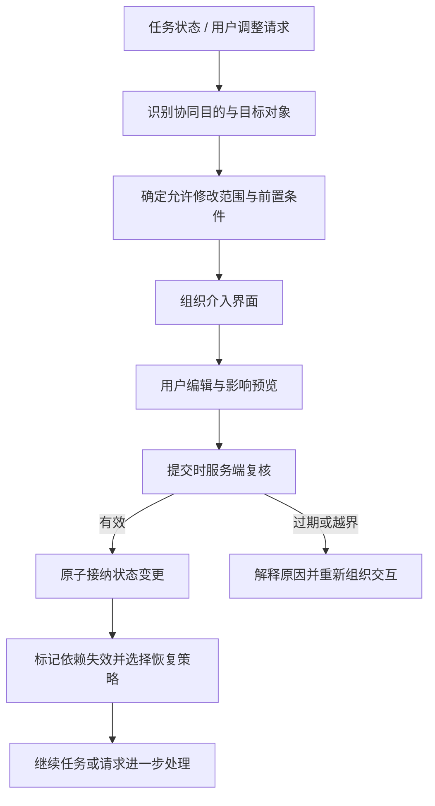
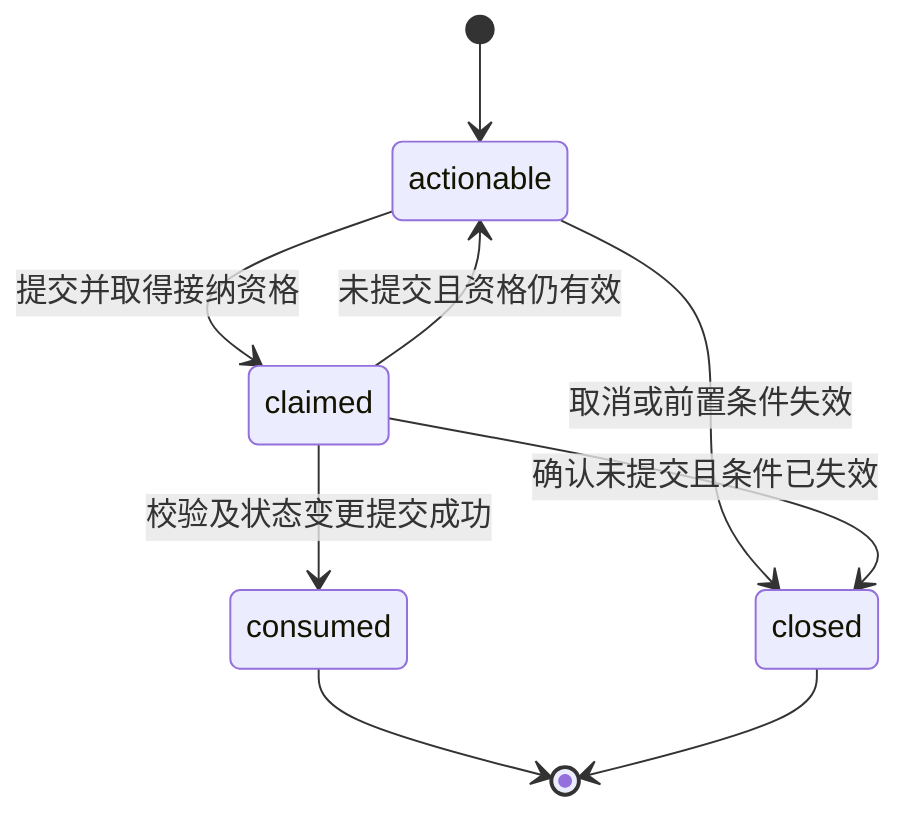

# 协同介入交互模型与技术方案报告

> 版本：v0.1｜日期：2026-09-29｜性质：候选设计与原型规格，不是已实现能力清单，也不是新颖性或授权结论。

本报告回答：**运行中的 Agent 需要用户参与时，如何让用户知道该看什么、可以改什么，以及修改后会发生什么。** 状态校验、作用域控制和恢复执行，是支撑这段交互可信、可预测的技术机制。

相关报告：[选题演进与阶段共识](./01-topic-consensus.md) · [专利检索与技术特征对比](./03-patent-comparison.md) · [候选创新点与深化路线](./04-innovation-roadmap.md) · [文献依据与推进步骤](./05-literature-plan.md)

## 1. 适用范围与现状边界

### 1.1 当前系统与研究方案分开记录

当前仓库的主链路是 Workbench → 薄 CopilotKit Runtime → AGUIMock / SACS，另有独立、仅开发使用的 map-validation-agent。本报告不把以下候选机制写成当前仓库已经具备的功能，也不据此扩大现有 Runtime 的职责：

- Surface Lifecycle：介入界面的创建、可操作资格与结束管理。
- Command Admission：用户操作进入任务状态之前的校验和接纳。
- Recovery：修改影响分析、检查点与恢复执行。
- Thread / Turn / Operation 统一平台化管理。

这些都属于**待验证、待确定责任归属的研究能力**。文中的 `runId`、`operationId`、`surfaceId` 等字段是候选逻辑模型，不表示现有协议已定义同名字段。本阶段只形成文档与后续原型规格，不调整现有架构。

### 1.2 问题边界

关注一次协同需求的完整交互过程，而非重新设计 Agent 的全部规划、调度或设备控制体系。2026-09-29 后续确认采用地图优先、无人巡检主场景；本报告保留可复用的机制描述，业务任务以 [06 主场景说明](06-patrol-scenario.md)为准。

无人巡检中按需验证三类操作：

1. 修改一次尚未执行或允许安全重算的工具参数。
2. 修改尚未执行的计划步骤。
3. 编辑与任务相关的地图条件。

不预设所有 Agent 都有可靠检查点，不预设所有任务都能局部恢复，更不把已执行的外部动作视为可随意回滚的数据字段。

## 2. 用户介入的对象与操作

### 2.1 五类介入对象

分类依据是“这次操作最终改变哪个对象”，而不是界面使用什么控件。它是工作分类，不宣称穷尽所有人机协作方式。

| 介入对象 | 用户要解决的问题 | 典型操作 | 范围边界 |
|---|---|---|---|
| 上下文 / 条件 | 缺少什么信息，或任务受什么限制？ | 补充地点、修改时间窗、绘制允许区域 | 修改条件可能影响多个计划步骤，应先说明影响 |
| 决策 | 几个可行方案选哪个？ | 选择、确认、否决、补充判断依据 | 选择某个方案与直接修改方案内容是两种操作 |
| 计划 | 接下来做哪些步骤，按什么顺序？ | 增加、修改、删除、重排步骤 | 必须校验依赖、已完成步骤及不可逆动作 |
| 执行动作 | 某一次具体调用如何执行？ | 修改参数、确认调用、取消尚未执行的调用 | 绑定具体 Operation / 工具调用，不能误改同名的其他调用 |
| 执行控制 | 整个任务或当前阶段何时运行？ | 暂停、继续、终止 | 发出控制请求不等于设备或任务已经达到目标状态 |

“补充、选择、修改、删除、重排、确认”是操作方式，可以出现在多类对象上。例如修改搜索半径：如果只是调整当前查询调用，则属于执行动作；如果改变整个任务的搜索边界，则属于上下文 / 条件。系统必须先确定语义对象，再组织界面。

### 2.2 跨对象操作

一段自然语言可能同时提出“扩大范围，并删掉最后一个步骤”。原型中应先解析为候选变更，再显示变更清单和影响范围；不得因为一句话包含多个意图，就静默扩大现有介入界面的权限。

- 多项修改在同一可提交边界内：统一预览、统一校验，整体成功或整体不写入。
- 超出当前边界：生成新的介入请求或转入重新规划，并向用户说明。
- 不能可靠理解：要求用户澄清，不替用户猜测并直接执行。

## 3. 一次介入交互的基本结构

### 3.1 Surface 的含义

本报告中，**Surface 指一次协同需求对应的介入界面**。它可以是一张参数卡、方案对比卡、计划编辑器，也可以由面板与地图工具共同组成。它不是整个页面，也不等同于 A2UI 中某个同名协议对象；两者是否映射需要单独设计。

每个介入界面至少回答六件事：

| 要素 | 面向用户的表达 | 系统需保存的关联 |
|---|---|---|
| 出现原因 | “当前范围内未找到可用对象，需要调整范围。” | 触发事件、协同目的 |
| 目标对象 | “修改本次查询的搜索半径。” | 任务、执行实例、操作、目标字段 |
| 必要信息 | 当前值、允许范围、相关限制、预计影响 | 信息来源及适用条件 |
| 允许操作 | 半径可改，任务目标不可在此修改 | 允许字段、动作与值域 |
| 生效规则 | “提交后重新查询，原有目标保持有效。” | 校验条件、变更规则、影响规则 |
| 结束方式 | 已应用、已取消、已失效，或需要重新处理 | 消费记录、关闭原因、替代界面 |

“最小充分”在原型阶段采用可解释规则：展示完成本次操作所必需的对象信息、约束信息、影响说明及可选操作。它不是“控件越少越好”，更不是隐藏风险、依据或取消入口。关键证据可按需展开；无法证明必要性的附加信息不默认占据主要区域。

### 3.2 用户视角的完整流程

1. **看见原因**：说明为什么现在需要参与，任务是否等待此操作。
2. **看见边界**：突出当前对象、可改内容与当前值；限制信息就近展示。
3. **完成操作**：编辑、选择或确认，必要时预览修改影响。
4. **提交并等待确认**：界面显示“正在提交”，防止误以为任务已经执行。
5. **得到明确结果**：分别显示“修改已接纳”“任务正在恢复”“任务已继续”或失败原因。
6. **返回任务上下文**：结束后的介入记录进入历史，可追溯，但不继续接受旧操作。

用户主动发起调整也使用同一流程：先找到目标对象和允许边界，再形成介入界面，不要求所有介入都由 Agent 主动提出。

### 3.3 与常驻任务界面的关系

任务状态与暂停、终止等常用控制可以常驻、可折叠。一次需要用户答复的介入界面可临时接管输入区域，避免用户分不清“当前必须处理的问题”和“普通新指令”；处理完后恢复自然语言输入并保留记录。

是否阻塞任务与是否占据输入区域是不同决策。非阻塞提示不应无理由锁住整个输入区；暂停、终止等必要入口应保持可达。多个请求同时出现时，原型先采用单个主介入界面加待处理队列，避免相互覆盖。

## 4. 候选技术模型

### 4.1 从协同需求到受控界面



逻辑步骤不要求对应独立服务。特别是校验、变更和恢复责任应在原型验证后，再结合现有 Agent 执行端能力确定，不直接塞入薄 Runtime。

### 4.2 Intervention Context 示例

以下是一次只读查询的参数调整示例，单位采用米，字段与协议均为候选设计。

```json
{
  "interventionId": "iv-014",
  "surfaceId": "sf-014",
  "taskId": "task-008",
  "threadId": "thread-008",
  "sourceRunId": "run-003",
  "operationId": "op-query-027",
  "purpose": "modify-parameter",
  "trigger": "no-candidate-in-current-area",
  "target": {
    "kind": "tool-call",
    "id": "query-027",
    "executionStatus": "waiting-for-adjustment"
  },
  "allowedMutation": {
    "paths": ["/arguments/radiusMeters"],
    "actions": ["replace"],
    "constraints": { "minimum": 100, "maximum": 1000 }
  },
  "preconditions": {
    "targetRevision": 6,
    "constraintRevision": 3,
    "queryCenterRevision": 2,
    "allowedExecutionStatuses": ["waiting-for-adjustment"]
  },
  "blockingScope": "query-027-and-dependents",
  "presentation": {
    "component": "radius-editor",
    "requiredInformation": ["current-radius", "permitted-range", "change-impact"]
  },
  "recovery": {
    "candidateAnchor": "before-query-027",
    "requiresCheckpointValidation": true,
    "onUnavailable": "request-replan-confirmation"
  },
  "expiresAt": "2026-09-29T15:00:00+08:00"
}
```

用户提交内容可以简化为：

```json
{
  "surfaceId": "sf-014",
  "actionId": "act-092",
  "idempotencyKey": "task-008-sf-014-submit-001",
  "expectedTargetRevision": 6,
  "patch": [
    { "op": "replace", "path": "/arguments/radiusMeters", "value": 800 }
  ]
}
```

这里的 `patch` 是研究内部变更表达，不是新增的 AG-UI 标准字段；路径相对于受控目标对象。`sourceRunId` 记录产生协同请求的 Run，继续工作流可能使用新 Run。客户端提交的是操作意图。允许范围、前置条件、目标绑定关系应由权威状态侧保存和验证，不能信任客户端自行上传的 `allowedMutation`。修改后另一次新的提交必须使用新的幂等键，不能把同一键用于不同载荷。

### 4.3 临时作用域如何得到

初始原型使用确定性规则计算：

> 本次可修改范围 = 目标对象在当前执行阶段可修改的字段 ∩ 当前操作者权限 ∩ 业务约束允许范围 ∩ 本次协同目的需要的范围。

四者有任一项不明确，就缩小范围或转入澄清。介入作用域不能扩大操作者原有权限；用户角色权限只是上限，不等于本次需要开放的全部能力。

范围不能只限定字段名，还应限定允许的变更类型、值域、对象集合和阶段。例如删除计划步骤必须检查依赖；地图编辑必须检查几何类型、边界及关联的任务条件。

### 4.4 规则与 LLM 的边界

规则优先完成权限、状态前置条件、值域、依赖和恢复条件判断。LLM 可选地用于解释需求、提出候选对象或字段、生成简明说明，以及在白名单组件中提出组合建议。

LLM 输出必须经 Schema 与规则校验；无法确定时退回固定组件或澄清流程。**LLM 不持有授权决定权，不得自行增加可修改字段、免除校验或决定重放具有外部副作用的动作。** 为避免研究范围失控，首个原型不依赖 LLM 生成任意组件代码。

### 4.5 与现行协议和执行框架的衔接

2026-09-29 核验的 [AG-UI Interrupts 官方文档](https://docs.ag-ui.com/concepts/interrupts)已有工具绑定、回复 Schema、过期和幂等恢复。`editedArgs` 是全量替换；恢复使用同一 Thread 的新 Run，须覆盖该次中断的全部未决项，未决项限制新输入。

本方案的适配选择：内部 Patch 先经服务端校验，再基于权威参数合成完整值；排队显示不等于逐项恢复；`blockingScope` 不得覆盖协议语义，非阻塞提示需另行适配。这些协议基础不作为候选创新。

[LangGraph Interrupts 官方文档](https://docs.langchain.com/oss/python/langgraph/interrupts)指出，恢复时中断所在节点会从头执行，之前的代码可能重跑。因此恢复锚点必须由执行后端依据合法检查点和节点能力决定，不能接受前端传入任意恢复地址，也不能描述为源码行级精确续跑。

以上核验说明在线文档的能力，不代表本仓库锁定的依赖版本和适配器已经支持；接入前须复核实际安装版本及测试结果。

## 5. 状态绑定、提交与生命周期

### 5.1 相关状态变化才触发重新判断

不能简单规定“全局版本从 v12 变成 v13，所有旧界面都失效”。长时任务中，日志增加、无关对象位置更新等变化很频繁，这样会使用户无法完成编辑。

每个 Surface 保存与操作正确性相关的读集合或前置条件，例如目标参数版本、约束版本、候选对象可用性、所编辑步骤的执行状态。全局序号可用于同步，但不应自动等同于介入失效条件。

| 状态变化 | 候选处理 |
|---|---|
| 新增无关日志、其他独立任务更新 | 保留当前操作资格 |
| 本次可改字段已被其他操作修改 | 重新校验，展示差异；必要时使旧界面失效 |
| 本次候选项被撤销 | 禁用失效选项，重发或更新介入界面 |
| 目标操作已经执行或任务终止 | 拒绝旧操作，解释原因 |
| 约束变更使允许值域缩小 | 更新范围并要求用户确认，不能静默接受旧值 |

编辑期间可用事件推送尽早更新提示；**最终接纳之前仍需复核**，不能把前端按钮禁用作为一致性保障。

### 5.2 两个状态轴

以下是候选状态模型，不描述当前仓库已有生命周期实现。

| 状态轴 | 候选值 | 说明 |
|---|---|---|
| 展示归属 | `current` / `historical` | 是否属于当前待处理交互，还是历史记录 |
| 操作处理 | `actionable` / `claimed` / `consumed` / `closed` | 可提交、正在接纳、已成功接纳、因取消或失效关闭 |

`closed` 另记录 `cancelled`、`stale`、`superseded`、`task-ended` 等原因。`consumed` 表示操作已被接纳，不表示后续外部任务一定完成。



展示轴独立记录：结束的 Surface 通常从 `current` 进入 `historical`；历史记录不能因为前端重新加载而恢复操作资格。网络中断造成结果不明时，不直接把 `claimed` 恢复为 `actionable`，先查询提交记录。

`claimed` 如采用租约，只解决并发接纳协调。租约过期不代表之前的操作一定没有生效，恢复时仍需查询事务和幂等记录。

### 5.3 原子接纳与幂等

在同一个可事务化的权威状态存储内，候选提交边界包含：

1. 验证调用者身份、Surface 资格、目标绑定、相关状态及载荷范围。
2. 使用条件更新避免检查后到写入前目标被改变。
3. 写入状态变更与失效标记。
4. 记录 Surface 消费结果、幂等记录和审计信息。
5. 如需异步恢复，在同一事务中写入待派发恢复事件。

事务提交后，恢复工作者再处理事件。若系统跨多个存储，不能假装这些动作天然原子：必须先界定一个权威接纳记录，再设计可重试同步与对账，或缩小原型的事务边界。

同一幂等键与同一载荷重复到达时返回同一接纳结果；同一键对应不同载荷时拒绝。前端防连点只是体验措施，服务端条件更新和幂等记录才用于避免重复状态提交。

“状态修改只接纳一次”与“外部动作只执行一次”不同。消息重复投递、执行端崩溃和设备回执丢失仍需分别处理；本方案不承诺跨系统 exactly-once。

## 6. 修改影响与任务继续

### 6.1 修改范围不等于失效范围

用户允许修改的字段可能只有一个，但依赖该字段的结果可能很多。例如修改搜索范围，仅直接写入范围字段，却可能使查询结果、候选排序、后续方案全部失效。

因此要区分：

- **直接变更集**：本次允许用户写入的对象与字段。
- **受影响集**：由依赖关系和业务规则计算的失效结果或待重新验证对象。
- **恢复执行集**：实际需要重新运行的步骤，受执行能力与副作用约束。

“仅局部回写”不等于下游完全不变。若依赖信息缺失，不能声称找到了完整而精确的最小重算集合；应扩大重算范围或退回阶段重启，并告知用户。

### 6.2 保留与恢复的条件

保留已完成工作需要同时满足：未受变更影响、数据仍在有效期内、对应外部状态仍可确认。恢复点应由执行后端在提交后依据最新状态和可用检查点再次确定，界面生成时记录的 `candidateAnchor` 只是候选位置，不是客户端可自由设置的跳转指令。

| 条件 | 恢复策略 | 用户反馈 |
|---|---|---|
| 依赖清晰，检查点有效，无需重放副作用 | 从指定步骤之前继续 | “已保存修改，将重新执行查询及其后续分析。” |
| 只能确认某阶段边界有效 | 从阶段边界重算 | “需重新执行本阶段，先前阶段的有效结果保留。” |
| 缺少检查点或执行端不支持恢复 | 新一轮规划或新 Run，关联原任务 | “此执行方式不支持原位继续，需重新生成后续计划。” |
| 已产生外部副作用或执行结果不明 | 暂停并核查真实状态，必要时走补偿流程 | “需要先确认动作结果，暂不重复发送。” |

“确定恢复位置”指恢复策略有明确、可验证的执行锚点，不表示之后的 LLM 推理结果具有确定性，也不保证任意 Agent 可精确续跑。

### 6.3 外部副作用

只读查询可按策略重试；发送设备指令、提交订单、写入外部系统等操作不能简单通过“使旧结果失效”来撤销。已有副作用需要执行记录、回执或读回核查；如果有补偿动作，应单独建模并按其权限和风险要求处理。

用户修改已执行动作的参数，应被解释为新的调整请求，不能悄悄改写历史使界面看起来像原动作从未发生。

## 7. 三个实施例

本节 A/B/C 保留为参数、计划与空间条件的技术示例；主场景任务 M1/M2 见 [06](06-patrol-scenario.md)。验证顺序以无人巡检的业务触发为依据，不要求先完成非地图例 A 才开始地图交互，也不要求一次异常同时触发全部操作。

### 7.1 实施例 A：修改一次查询的工具参数

**场景**：Agent 查询指定中心点周围可用巡检资源，500 米范围内没有候选项，请用户调整范围。这里的查询是只读操作，不包含设备出动指令。

| 顺序 | 用户看到 / 操作 | 系统候选处理 |
|---|---|---|
| 1 | “500 米范围内暂无可用资源。可扩大至 1000 米。” | 生成绑定 `query-027` 的介入请求，依赖查询中心、约束及该调用版本 |
| 2 | 半径输入框、允许值域、简短影响说明；其他参数仅作上下文显示 | 只开放 `arguments.radiusMeters`，不开放任务目标和调度权限 |
| 3 | 改为 800 米，点击“应用并重新查询” | 本地做格式检查；服务端重新检查目标仍处于等待调整状态 |
| 4 | “修改已接纳，正在重新查询。” | 原子写入参数、标记旧查询结果与依赖分析失效、消费 Surface、记录恢复事件 |
| 5 | 更新后的候选列表；历史卡片标记“半径 500 → 800 米” | 从有效检查点继续；只有仍有效的目标、约束和上游结果保留 |

异常示例：提交前查询中心发生变化，应说明“查询位置已更新，请检查新范围”，而不是仅因为版本不匹配显示“系统错误”。另一独立任务新增日志不应导致该卡片失效。

### 7.2 实施例 B：修改计划步骤

**场景**：任务计划为“检查区域条件 → 查询资源 → 对候选结果排序 → 汇总方案”。用户希望调整尚未执行的步骤。

用户先看到步骤状态、依赖关系的简化提示，以及可执行的修改入口。已经完成或正在产生外部动作的步骤不能以普通拖拽方式重排；锁定原因应可见。

| 用户操作 | 系统校验 | 反馈 |
|---|---|---|
| 修改排序步骤的偏好权重 | 权重类型与范围、资源查询结果是否仍有效 | 展示修改前后差异；说明将重新排序 |
| 把“排序”拖到“查询资源”之前 | 检查数据依赖 | 拒绝并解释“排序需要查询结果”，保留用户其他草稿 |
| 删除一个尚未执行的可选说明步骤 | 检查该步骤是否为必需交付、是否有下游依赖 | 无影响则允许；有影响时显示受影响项，并重新确定作用域 |
| 删除必需的条件检查 | 检查不可移除约束 | 拒绝，不能因用户可编辑计划而跳过强制条件 |

提交前给出变更摘要，例如“保留已完成查询；重新计算排序和汇总”。计划编辑不能只记录数组重排；需保持步骤标识、依赖和执行状态的对应关系。

若执行端只有“提交新计划”的能力，原型应明确展示“生成修订计划并启动后续执行”，不得包装成原执行栈精确续跑。初期可只支持单步骤参数修改，再逐步验证增删与重排。

### 7.3 实施例 C：地图条件编辑

**场景**：用户需要调整本次巡检的允许区域。该操作属于“上下文 / 条件”，不自动等价于重规划设备路线。

| 阶段 | 交互呈现 | 约束与状态处理 |
|---|---|---|
| 发起 | 面板说明“调整本次允许区域”，地图突出当前区域 | 绑定区域对象 ID、任务条件字段及几何版本 |
| 编辑 | 只激活多边形编辑工具，显示面积和边界限制 | 其他对象不进入编辑；几何类型、坐标系、有效性与边界规则固定 |
| 预览 | 显示新旧区域差异、受影响步骤与待重新核查项 | 计算几何校验和任务依赖，不宣称已自动生成新路线 |
| 提交 | “应用区域修改” | 服务端复核几何、权限、区域版本及任务阶段 |
| 结束 | 新区域生效，历史记录保留旧几何摘要 | 下游查询或方案标记待验证；若没有重规划能力，提示后续人工或 Agent 处理 |

地图交互能力按本次目的开放，例如改区域只开放区域编辑，选候选位置只允许选择候选集合。浏览器中的画图操作可由前端交互组件完成；不因使用地图就预设必须让业务 Agent 调用前端工具。

## 8. 异常与并发分支

| 分支 | 系统行为 | 用户应看到 |
|---|---|---|
| 用户取消 | 关闭本次介入；不写入任务变更；按原协同需求决定继续等待、维持原条件或请求替代方案 | “已取消修改”；不能默认显示“任务已继续” |
| 目标已变化 | 拒绝旧提交，提供变化摘要；必要时生成新的 Surface | 哪一项变了、为什么当前操作不再适用 |
| 修改越界 | 拒绝越界载荷，不做部分静默写入 | 哪项不可修改；可选的新调整入口 |
| 依赖校验失败 | 保留有效草稿，要求修正或扩大交互范围后重新确认 | 被阻止的依赖关系及修正建议 |
| 并发提交同一对象 | 条件更新只接纳有效提交；后到请求重新读取状态 | 已被更新的字段与差异 |
| 双击 / 网络重试 | 幂等查询返回已有结果 | 同一处理结果，不出现重复成功记录 |
| 提交结果不明 | 查询接纳记录后再决定是否重试 | “正在确认提交结果”，避免误导用户再次发起不同操作 |
| 接纳成功但恢复失败 | 保留已接纳修改和失败记录，不伪造未发生状态 | “修改已保存，任务恢复失败”，提供受控重试或其他路径 |
| 无法局部恢复 | 选择阶段重算或重新规划，先说明扩大后的影响 | 哪些工作需要重做、哪些仍可保留 |
| 外部动作结果不明 | 暂停重复派发，核查执行端状态 | 核查中及必要的人工处理入口 |
| 任务已终止 | 关闭相关 Surface，拒绝新修改 | 终止状态与只读历史 |

多操作者原型不是首阶段必需，但单用户多标签页已经会产生并发提交，应纳入基本校验。取消与提交同时到达时，应以权威接纳记录的原子结果为准；不能在已接纳后仅隐藏卡片就宣称取消成功。

## 9. 可测不变量与原型验收

以下是待验证性质，不是已经测得的效果。

| 编号 | 不变量 / 验收条件 | 最小验证方式 |
|---|---|---|
| I1 | 每个操作关联唯一的 Surface、目标对象及执行实例 | 同名工具存在多个调用时，只修改绑定调用 |
| I2 | 直接变更集不超出本次允许范围和原有权限 | 篡改请求加入未授权字段，验证拒绝且无部分写入 |
| I3 | 接纳时前置条件满足，检查与写入之间没有未处理竞争 | 提交前后注入目标更新，验证冲突不能覆盖新状态 |
| I4 | 无关状态变化不无故剥夺操作资格 | 仅新增无关日志后提交仍有效 |
| I5 | 历史或已消费 Surface 不能产生新的重复状态变更 | 刷新页面、重放事件和重复提交后核对记录 |
| I6 | 同一幂等键同一载荷有同一接纳结果，不同载荷被拒绝 | 网络重试及载荷冲突测试 |
| I7 | 计划修改保持必需依赖与不可移除约束 | 删除前置节点或反向重排时验证拒绝 |
| I8 | 被标记失效的结果不会继续作为有效输入使用 | 半径变化后，旧候选排序不能直接用于汇总 |
| I9 | 每次恢复有可解释锚点或明确回退策略 | 删除检查点，验证进入阶段重算或重新规划 |
| I10 | 有副作用或结果不明的操作不会因状态重算而盲目重复 | 模拟外部执行成功但回执丢失 |
| I11 | 界面区分修改接纳、恢复执行和执行完成 | 在恢复失败时仍准确呈现修改已保存 |
| I12 | 审计可还原用户看到的版本、提交内容与接纳结果 | 按介入 ID 重建一次成功与一次过期提交的记录 |

交互效果另行测量：完成一次调整的操作数、耗时、误操作率、对修改影响的理解正确率。系统效果测量：过期提交拦截、重复状态写入、受影响步骤重算和恢复失败处理。不能仅凭界面截图证明认知负担下降，也不能仅凭流程跑通证明专利具有创造性。

## 10. 最小原型与待决策事项

首个原型建议限定为：一台模拟巡检车、少量巡检点、一条预设异常，地图选点配合固定受控介入卡，并用有限规则和模拟执行器核对修改结果。先完成 M1 的正常路径、取消、过期和重复提交，再加入 M2 的未执行点调整与无法继续分支。自由绘图按真实编辑需要后置；地图对象关联从首版参与。

原型需显式标明模拟执行与真实执行，不能把 Mock 中可控制的恢复能力直接推断为 SACS 或任意 Agent 的能力。研究分支与现有主链路的接入方式须在实现前另作设计；本报告不构成架构迁移决定。

待后续确定的问题：

1. 实际执行端能提供哪些目标标识、状态前置条件、依赖和检查点？
2. 谁持有权威任务状态和操作接纳记录？事务边界在哪里？
3. 首阶段是否只支持用户确认后的固定规则介入，何时才需要 LLM？
4. 哪些条件变更必须重新规划，哪些确实可以局部继续？
5. “必要信息”怎样按任务类型形成可检查清单，并通过对照实验验证？
6. 多请求优先级、操作租约与跨标签页状态同步需要做到什么程度？

报告形成的是一条可验证的候选链：**确定用户此刻要参与什么 → 组织有边界的介入界面 → 在当前状态下接纳合法操作 → 说明影响并继续任务。** 是否具有可保护的技术差异，应与第三、第四份报告中的检索证据和差异假设共同判断。
